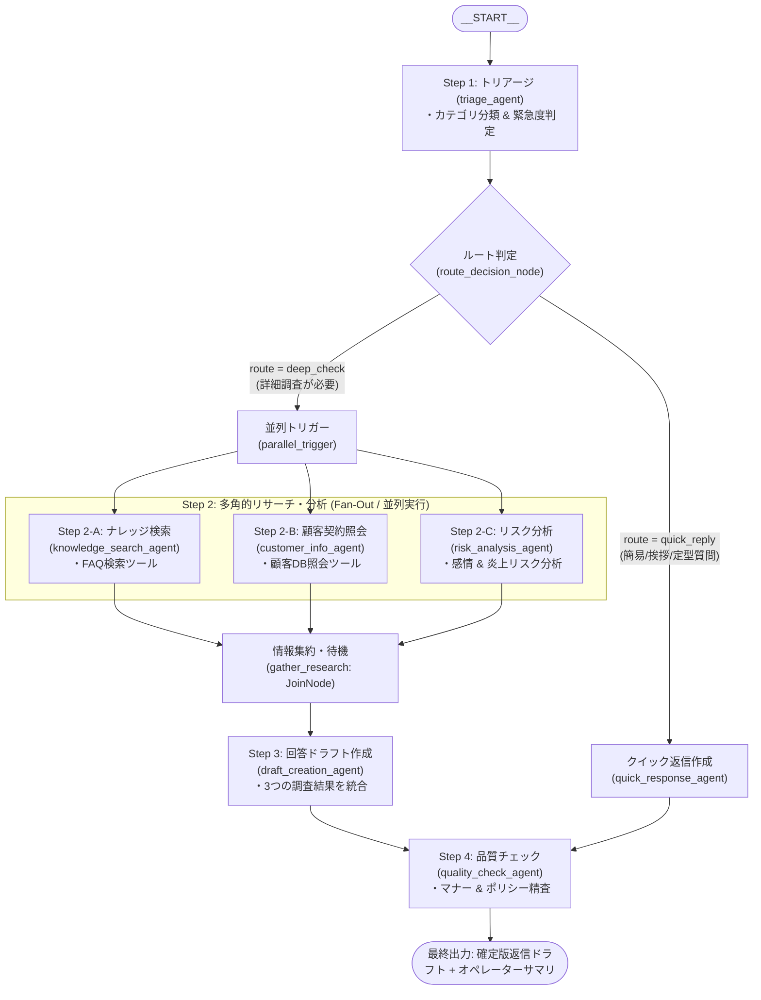

# ADK 2.0 ハッカソン サンプルコード
## カスタマーサポート問い合わせ自動トリアージ＆回答ドラフト作成ワークフロー

本リポジトリは、Google の最新エージェント開発フレームワーク **Agent Development Kit (ADK) 2.0** における **`Workflow`（グラフベース・オーケストレーション）** を活用したマルチエージェント・ワークフローのサンプル実装です。

ビジネスシーンで汎用性の高い「カスタマーサポートの問い合わせ受付からトリアージ、詳細調査（並列実行）、回答ドラフト作成、品質チェックまでの一連の業務」を、**条件分岐（Routing）**、**並列実行（Fan-Out）**、**同期集約（Fan-In / JoinNode）**、**順次実行（Sequential）** を組み合わせて自動化しています。

---

## 🏗️ ワークフロー構造



---

## 💻 ADK 2.0 `Workflow` コード構造 (`customer_support/agent.py`)

ADK 2.0 特有のグラフベース定義（`Workflow`, `edges`, `JoinNode`, `START`）により、複雑な分岐や並列処理を直感的に記述できます。

```python
root_agent = Workflow(
    name="customer_support_workflow",
    description="カスタマーサポート問い合わせ自動トリアージ＆回答ドラフト作成ワークフロー",
    edges=[
        # --- (A) 条件分岐 (Routing) ---
        # 開始 -> トリアージ -> ルート判定ノード -> { deep_check / quick_reply }
        (
            START,
            triage_agent,
            route_decision_node,
            {
                "deep_check": parallel_trigger,       # 詳細調査時は並列トリガーへ
                "quick_reply": quick_response_agent, # 簡易回答時はクイック返信エージェントへ
            },
        ),

        # --- (B) Fan-Out（並列実行） ---
        # parallel_trigger から 3 つの独立した調査へ同時に分岐
        (parallel_trigger, knowledge_search_agent, gather_research),
        (parallel_trigger, customer_info_agent, gather_research),
        (parallel_trigger, risk_analysis_agent, gather_research),

        # --- (C) Fan-In（同期・集約） & ドラフト作成 ---
        # 3つの調査がすべて完了したら gather_research (JoinNode) から回答ドラフト作成エージェントへ
        (gather_research, draft_creation_agent, quality_check_agent),

        # --- (D) クイック返信ルートの品質チェック ---
        # 簡易回答ルートも最終的に品質チェックエージェントを通る
        (quick_response_agent, quality_check_agent),
    ],
)
```

---

## 📁 ディレクトリ構成

ADK のベストプラクティスに基づき、エージェント定義は有効な Python 識別子パッケージ（`customer_support/`）内に配置されています。

```
adk-hackason/                     # リポジトリルート（ハイフン付きリポジトリ名でOK）
├── customer_support/             # エージェントパッケージ（Python識別子命名）
│   ├── __init__.py               # root_agent をエクスポート
│   ├── agent.py                  # メインの ADK 2.0 Workflow / エージェント定義 (root_agent)
│   ├── prompts/                  # 各エージェントのプロンプト定義モジュール
│   │   ├── __init__.py
│   │   ├── triage.py             # Step 1: トリアージ用プロンプト
│   │   ├── quick.py              # 分岐: クイック返信用プロンプト
│   │   ├── knowledge.py          # Step 2-A: ナレッジ検索用プロンプト
│   │   ├── customer.py           # Step 2-B: 顧客照会用プロンプト
│   │   ├── risk.py               # Step 2-C: 感情・リスク分析用プロンプト
│   │   ├── draft.py              # Step 3: 回答ドラフト作成用プロンプト
│   │   └── quality.py            # Step 4: 品質チェック用プロンプト
│   └── tools/                    # モックツール・関数定義
│       ├── __init__.py
│       ├── knowledge_tool.py     # 社内FAQ/ナレッジ検索モック (search_knowledge_base)
│       └── customer_tool.py      # 顧客情報・契約照会モック (get_customer_info)
├── docs/                         # 設計書・解説ドキュメント集
│   ├── adk_2_0_guide.md          # 初心者向け ADK 2.0 解説ガイド
│   ├── hands_on_playbook.md      # ハンズオン受講者向け実行・デプロイ手順書
│   └── system_design.md          # システム設計書
├── requirements.txt              # 依存パッケージ (google-adk, google-genai 等)
├── .env.example                  # 環境変数設定サンプル
├── .gitignore
└── README.md                     # 本ドキュメント
```

---

## 📖 ハンズオン受講者向けガイド

ハンズオンの環境構築、ローカルでの動作確認、Gemini Enterprise Agent Platform (Agent Runtime) へのデプロイ手順、およびカスタマイズのアイデア集はすべて以下のプレイブックに記載されています。

👉 **[ハンズオン実行・デプロイ手順書 (`docs/hands_on_playbook.md`)](docs/hands_on_playbook.md)**

- [1. リポジトリの準備・仮想環境の作成](docs/hands_on_playbook.md#1-リポジトリの準備)
- [2. 依存パッケージと環境設定](docs/hands_on_playbook.md#3-依存パッケージのインストール)
- [3. 開発用 Web UI (`adk web`) での動作確認](docs/hands_on_playbook.md#5-開発用webサーバーの起動-adk-web)
- [4. Agent Runtime へのデプロイ & Google Cloud コンソールでの動作確認](docs/hands_on_playbook.md#☁️-agent-runtime-へのデプロイ)
- [5. ハッカソン向け業務ユースケース・カスタマイズガイド](docs/hands_on_playbook.md#🎯-ハッカソン向けエージェント適用業務のアイデア集)