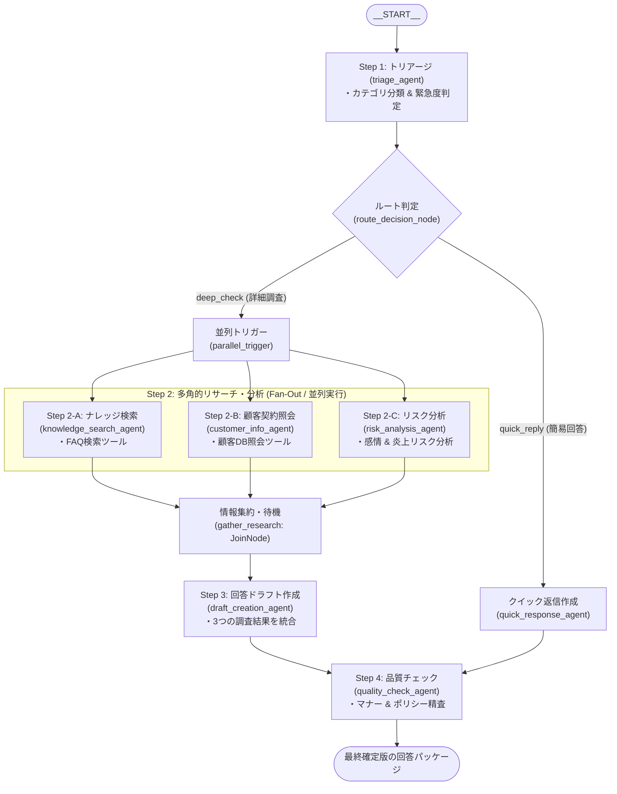

# ADK 2.0 マルチエージェント開発 初心者向け徹底解説ガイド

Google のエージェント開発フレームワーク **Agent Development Kit (ADK) 2.0** では、従来の単一エージェントや単純な会話委譲にとどまらず、**グラフベースのワークフロー（`Workflow`）** によって高度なマルチエージェントシステムを直感的に構築できるようになりました。

本ガイドは、ADK 2.0 の基本概念からコードの書き方、マルチエージェントの連携制御までを初心者向けにわかりやすく解説したドキュメントです。  
実際のリファレンス実装である `customer_support/agent.py` のコードと見比べながら読み進めることで、実践的な書き方を身につけることができます。

---

## 目次

1. [ADK 2.0 とは？（従来型との違い）](#1-adk-20-とは従来型との違い)
2. [全体像の把握：サンプルシステムの構造](#2-全体像の把握サンプルシステムの構造)
3. [基本要素①：専門エージェントを作る (`LlmAgent`)](#3-基本要素専門エージェントを作る-llmagent)
4. [基本要素②：ツールを持たせる (`tools` と Python 関数)](#4-基本要素ツールを持たせる-tools-と-python-関数)
5. [基本要素③：データを受け渡す (`output_key` とセッションステート)](#5-基本要素データを受け渡す-output_key-とセッションステート)
6. [基本要素④：処理を制御する (`FunctionNode` と `JoinNode`)](#6-基本要素処理を制御する-functionnode-と-joinnode)
7. [ワークフローの組み立て (`Workflow` と `edges`)](#7-ワークフローの組み立て-workflow-と-edges)
8. [エージェントの公開ルールとディレクトリ設計](#8-エージェントの公開ルールとディレクトリ設計)
9. [Web UI (`adk web`) での動作確認と観察ポイント](#9-web-ui-adk-web-での動作確認と観察ポイント)
10. [ハンズオン：自分でカスタマイズしてみよう](#10-ハンズオン自分でカスタマイズしてみよう)
11. [まとめ & ADK 2.0 クイックチートシート](#11-まとめ--adk-20-クイックチートシート)

---

## 1. ADK 2.0 とは？（従来型との違い）

AI エージェントを業務システムに組み込む際、1つの巨大なプロンプトや1つのエージェントにすべてを任せると、以下のような課題が生じます。

- プロンプトが肥大化し、指示の精度が落ちる
- どの順番でツールを呼び、どのように推論したのか追跡しにくい
- 独立して調査できるタスクを直列に行うためレスポンスが遅い

ADK 2.0 では、**専門性を持った複数の小さなエージェント（`LlmAgent`）** と **制御ノード（`FunctionNode` / `JoinNode`）** を **グラフ（`Workflow`）** として組み合わせることで、複雑な業務フローを安定的・高速に実行できます。

| 比較項目 | 従来の単一/委譲型エージェント | ADK 2.0 グラフベース `Workflow` |
| :--- | :--- | :--- |
| **役割分担** | 1つのエージェントが何でもこなす | 各エージェントが単一の専門業務に特化 |
| **処理フロー** | LLM の気まぐれな会話委譲に依存 | 開発者がノードとエッジ（グラフ）で明示的に制御 |
| **並列処理** | 困難（逐次実行のみ） | **Fan-Out（並列実行）と Fan-In（集約）が容易** |
| **デバッグ性** | どこで失敗したか特定しにくい | 各ノードのステートや入出力が可視化される |

---

## 2. 全体像の把握：サンプルシステムの構造

本リポジトリの `customer_support/agent.py` では、「**カスタマーサポートにおける問い合わせ自動トリアージ＆回答ドラフト作成**」を題材に、ADK 2.0 の主要パターンを網羅しています。

### ワークフローの全体図



### `customer_support/agent.py` の構成ブロック

`customer_support/agent.py` は大きく以下の4つのブロックで書かれています。

1. **インポートと環境設定**（ライブラリ読み込み、モデル指定）
2. **専門エージェントの定義 (`LlmAgent`)**（各ステップの担当エージェント作成）
3. **制御ノードの定義 (`FunctionNode` / `JoinNode`)**（分岐や集約の仕組み）
4. **ワークフローの組み立て (`Workflow` & `edges`)**（グラフ構造の定義）

それでは、1つずつコードを見ながら解説していきます。

---

## 3. 基本要素①：専門エージェントを作る (`LlmAgent`)

`LlmAgent` は、LLM（Gemini）を利用して推論、指示の実行、ツール呼び出しを行うエージェントの基本単位です。

### コード例（`customer_support/agent.py` より抜粋）

```python
# customer_support/agent.py: L56-63
# Step 1: トリアージエージェント
triage_agent = LlmAgent(
    name="triage_agent",
    model=MODEL_NAME,
    instruction=TRIAGE_INSTRUCTION,
    output_key="triage_result",
    description="顧客からの問い合わせ内容を分析し、カテゴリ分類と緊急度を判定するエージェント",
)
```

### パラメータの解説

| 引数名 | 型 | 説明 |
| :--- | :--- | :--- |
| `name` | `str` | エージェントの一意な識別名。Web UI やログでこの名前が表示されます。 |
| `model` | `str` | 使用する LLM モデル名（例: `"gemini-3.7-flash"`）。 |
| `instruction` | `str` | エージェントに対する指示（システムプロンプト）。役割や出力形式を定義します。 |
| `tools` | `list` | エージェントが実行できる Python 関数のリスト（Tool Calling）。省略可。 |
| `output_key` | `str` | **【重要】** エージェントの生成結果をセッションステート（メモリ）に保存するキー名。 |
| `description` | `str` | エージェントの簡単な説明（概要）。 |

> [!TIP]
> **エージェント設計のベストプラクティス**  
> 1つのエージェントに「分類もして、検索もして、ドラフトも書いて、チェックもして」と詰め込まず、「トリアージ専門」「ナレッジ検索専門」「回答作成専門」のように**単一責任（1エージェント1役割）**で分割するのがコツです。

---

## 4. 基本要素②：ツールを持たせる (`tools` と Python 関数)

エージェントに外部データベースの検索や API 呼び出しを行わせたい場合は、通常の Python 関数を定義して `tools=[...]` に渡します。

### ツールの定義例（`customer_support/tools/knowledge_tool.py` より抜粋）

```python
def search_knowledge_base(query: str, category: str = "") -> str:
    """社内ナレッジベースおよびFAQから、問い合わせ内容に関連する記事を検索します。

    Args:
        query: 検索キーワードや問い合わせ内容の要約（例: "レート制限 429"）
        category: 絞り込みカテゴリ（オプション。例: "技術的課題", "契約/請求"）

    Returns:
        検索結果の一覧（Markdownテキスト形式）。該当記事がない場合は汎用案内を返します。
    """
    # ...（Pythonによる検索処理）...
    return results_text
```

### エージェントへのツール紐付け（`customer_support/agent.py` より抜粋）

```python
# customer_support/agent.py: L65-73
knowledge_search_agent = LlmAgent(
    name="knowledge_search_agent",
    model=MODEL_NAME,
    instruction=KNOWLEDGE_INSTRUCTION,
    tools=[search_knowledge_base],   # ← ここに関数をリストで指定するだけ！
    output_key="knowledge_result",
    description="社内FAQやナレッジベースから解決に関連する技術情報・仕様を検索するエージェント",
)
```

### 💡 初心者が知っておくべき「ツール化のルール」

1. **型ヒント（Type Annotations）を必ず書く**  
   引数の `query: str` や戻り値の `-> str` を明記することで、ADK が自動的に LLM 向けスキーマ（JSON Schema）に変換します。
2. **docstring（関数の説明文）を丁寧に書く**  
   LLM は関数の docstring を読んで「いつ、どんな引数を渡してこのツールを呼ぶべきか」を判断します。引数（`Args`）の説明も忘れずに記述しましょう。
3. **戻り値は文字列または辞書にする**  
   ツールの実行結果は LLM にテキストとして渡されるため、`str` や `dict` を返すのが一般的です。

---

## 5. 基本要素③：データを受け渡す (`output_key` とセッションステート)

マルチエージェントで最も重要なのは、「**前段のエージェントが調べた結果を、後続のエージェントにどうやって伝えるか**」です。

ADK 2.0 では、**セッションステート（`ctx.state`）** と **プロンプト内プレースホルダー** を使ってシームレスにデータを受け渡します。

### ステップ 1: `output_key` で保存する
エージェントに `output_key="triage_result"` と指定すると、そのエージェントの出力が自動的にセッションステートの `"triage_result"` というキーに保存されます。

### ステップ 2: 後続エージェントのプロンプト内で `{キー名?}` で参照する

後続の回答ドラフト作成エージェントのプロンプト（`customer_support/prompts/draft.py`）を見てみましょう。

```python
# customer_support/prompts/draft.py より抜粋
DRAFT_INSTRUCTION = """あなたはカスタマーサポートの「回答ドラフト作成専門エージェント」です。
前段の各専門エージェントから収集された分析結果を統合し、完成度の高い返信案を作成してください。

【各エージェントの分析結果】
■ 1. トリアージ結果:
{triage_result?}

■ 2-A. ナレッジ・技術調査結果:
{knowledge_result?}

■ 2-B. 顧客・契約情報:
{customer_result?}

■ 2-C. 感情・リスク評価:
{risk_result?}

【あなたのタスク】
...
"""
```

> [!NOTE]
> **なぜ `{triage_result?}` のように `?` をつけるのか？**  
> 末尾に `?` をつけることで、もし該当するキーがステートにまだ存在しない場合でも、エラーにならず「空文字」として安全に展開されます（Optional プレースホルダー構文）。

---

## 6. 基本要素④：処理を制御する (`FunctionNode` と `JoinNode`)

LLM ではなく、**Python ロジックによる条件分岐** や **並列処理の集約** を行うためのノードが `FunctionNode` と `JoinNode` です。

### 1. `FunctionNode`: 条件分岐（Routing）の作成

問い合わせ内容に応じて「詳細調査へ進む」か「簡易返信（クイック）で済ませる」かを判定するノードです。

```python
# customer_support/agent.py: L126-144
def decide_route(ctx: Context, node_input: str = "") -> str:
    """トリアージ結果に基づいて後続のルート（詳細調査 or クイック返信）を決定します。"""
    # セッションステートからトリアージ結果を取得
    triage_output = ctx.state.get("triage_result", "") or str(node_input)

    # 簡易質問・挨拶・一般的な質問かつ低緊急度の場合はクイック返信へ
    if (
        ("カテゴリ: その他" in triage_output or "一般的な質問" in triage_output)
        and ("緊急度: 低" in triage_output)
        and ("技術" not in triage_output and "エラー" not in triage_output)
    ):
        ctx.route = "quick_reply"   # ← 分岐先のキー名をセット！
    else:
        ctx.route = "deep_check"    # ← 分岐先のキー名をセット！

    return f"Selected route: {ctx.route}"

# ノードとしてインスタンス化
route_decision_node = FunctionNode(
    name="route_decision_node",
    func=decide_route,
)
```

- **`ctx.route`**: このプロパティに文字列（例: `"deep_check"`）を代入すると、後述のワークフロー定義にある対応したエッジへ進みます。
- **`ctx.state`**: 過去の全ノードが保存したデータにアクセスできます。

### 2. `parallel_trigger`: 並列処理への分配ノード

複数のエージェントを同時に動かす（Fan-Out）際の起点となるノードです。

```python
# customer_support/agent.py: L147-162
def pass_through_trigger(ctx: Context, node_input: str = "") -> str:
    """Fan-Out（並列実行）用のトリガーノード。入力をそのまま後続エージェントへ中継します。"""
    return str(node_input)

parallel_trigger = FunctionNode(
    name="parallel_trigger",
    func=pass_through_trigger,
)
```

### 3. `JoinNode`: 並列ブランチの同期・集約（Fan-In）

並列実行された複数のエージェント（ナレッジ検索、顧客照会、リスク分析）は、完了するタイミングが異なります。  
`JoinNode` を置くことで、**接続されているすべての並列処理が完了するのを待機し、揃った段階で後続ノードを1回だけ呼び出す**ことができます。

```python
# customer_support/agent.py: L164-167
gather_research = JoinNode(
    name="gather_research",
)
```

---

## 7. ワークフローの組み立て (`Workflow` と `edges`)

定義したエージェントと制御ノードを接続し、完成したグラフを `Workflow` に登録します。

### ワークフローのコード（`customer_support/agent.py` より抜粋）

```python
# customer_support/agent.py: L173-203
root_agent = Workflow(
    name="customer_support_workflow",
    description="ADK 2.0 グラフベースのカスタマーサポート問い合わせ自動トリアージ＆回答ドラフト作成ワークフロー",
    edges=[
        # --- (A) 条件分岐 (Routing) ---
        (
            START,
            triage_agent,
            route_decision_node,
            {
                "deep_check": parallel_trigger,       # ctx.route が "deep_check" の場合の進み先
                "quick_reply": quick_response_agent, # ctx.route が "quick_reply" の場合の進み先
            },
        ),

        # --- (B) Fan-Out（並列実行） ---
        # parallel_trigger から 3 つの調査エージェントへ同時に分岐
        (parallel_trigger, knowledge_search_agent, gather_research),
        (parallel_trigger, customer_info_agent, gather_research),
        (parallel_trigger, risk_analysis_agent, gather_research),

        # --- (C) Fan-In（同期・集約） & ドラフト作成 ---
        # 3つの調査が完了したら gather_research からドラフト作成 -> 品質チェックへ
        (gather_research, draft_creation_agent, quality_check_agent),

        # --- (D) クイック返信ルートの品質チェック ---
        # クイック返信エージェントの出力も最終的に品質チェックを通す
        (quick_response_agent, quality_check_agent),
    ],
)

# エイリアス
workflow = root_agent
```

### `edges` の書き方パターンまとめ

ADK 2.0 では、タプルを使ってノード間の接続を直感的に記述できます。

| パターン | エッジの書き方 | 意味 |
| :--- | :--- | :--- |
| **順次実行 (Sequential)** | `(node_a, node_b, node_c)` | `node_a` が終わったら `node_b`、次に `node_c` を実行 |
| **条件分岐 (Routing)** | `(node_a, route_node, {"key1": dest1, "key2": dest2})` | `route_node` の `ctx.route` の値に応じて `dest1` または `dest2` に進む |
| **並列実行 (Fan-Out)** | `(trigger, branch1, gather)`<br/>`(trigger, branch2, gather)` | `trigger` から `branch1` と `branch2` が同時に起動し、両方とも `gather` に合流 |
| **同期集約 (Fan-In)** | `(gather_join_node, next_node)` | すべての並列ブランチの終了を待ってから `next_node` を実行 |

---

## 8. エージェントの公開ルールとディレクトリ設計

ADK がエージェントを自動認識して実行できるようにするための重要な設計ルールです。

### 1. `root_agent` の定義
ADK は各パッケージ内から **`root_agent`**（または `workflow`）という名前の変数を探してワークフローのエントリポイントとして読み込みます。

```python
# customer_support/__init__.py
from .agent import root_agent

__all__ = ["root_agent"]
```

### 2. ディレクトリ名と命名規則（⚠️ 最大の注意点）

ADK は Python の動的インポート（`importlib`）を使ってエージェントをロードします。そのため、**エージェントのフォルダ名は必ず Python の有効な識別子（半角英数字とアンダースコア `_` のみ）** にする必要があります。

```text
❌ 悪い例: customer-support/     (ハイフンが含まれているためインポートエラーになる)
✅ 良い例: customer_support/     (アンダースコアを使用する)
```

> [!IMPORTANT]
> リポジトリ名自体にハイフンが含まれている場合（例: `adk-hackason`）でも、リポジトリ直下に `customer_support/` のようなパッケージフォルダを配置する構成にすれば問題なく動作します。

---

## 9. Web UI (`adk web`) での動作確認と観察ポイント

実装したエージェントは、ADK 付属の Web UI を使ってブラウザ上で対話しながらテストできます。

### 起動コマンド

```bash
# Cloud Shell またはリモート環境での起動コマンド
adk web --port 8080 --allow_origins="regex:.*"
```

> [!TIP]
> `--allow_origins="regex:.*"` を付与することで、Cloud Shell の「ウェブでプレビュー」機能などの外部ホスト名経由でも 403 Forbidden エラーにならずにアクセスできます。

### Web UI での観察ポイント

1. **左側パネルでエージェントを選択**：`customer_support` が選択されていることを確認します。
2. **チャット欄に問い合わせを入力**：例として「*株式会社サンプル商事の佐藤です。APIを呼び出したらHTTP 429エラーが発生して困っています。*」と送信します。
3. **ノードの実行フローを確認**：
   - `triage_agent` がカテゴリを「技術的課題」、緊急度を「高」と判定
   - `route_decision_node` が `deep_check` ルートを選択
   - 3つのエージェント（ナレッジ検索、顧客照会、リスク分析）が**並列で Tool Calling や推論を実行**
   - `gather_research`（JoinNode）で集約された後、`draft_creation_agent` が全情報を取り入れた回答を作成
   - `quality_check_agent` が最終チェックを行い、回答が出力される

---

## 10. ハンズオン：自分でカスタマイズしてみよう

理解を深めるために、コードを少し書き換えてみましょう！

### チャレンジ 1: トリアージの緊急度基準を変更してみる
`customer_support/prompts/triage.py` を開き、緊急度「高」の条件に「怒りの絵文字や感嘆符が3つ以上ある場合」を追加してみましょう。

### チャレンジ 2: ナレッジベースに新しい記事を追加してみる
`customer_support/tools/knowledge_tool.py` の `KNOWLEDGE_BASE` リストに、新しい FAQ 記事（例: `KB-008: 請求書の再発行手順`）を追加してみましょう。

### チャレンジ 3: 新しい並列エージェントを追加してみる
`customer_support/agent.py` に、競合製品との比較や特記事項を調査する `competitor_analysis_agent` を作成し、`edges` の並列部分に追加してみましょう。

```python
# 新しいエージェントの定義
competitor_analysis_agent = LlmAgent(
    name="competitor_analysis_agent",
    model=MODEL_NAME,
    instruction="問い合わせ内容に他社名や競合サービスが含まれているか分析してください。",
    output_key="competitor_result",
)

# edges への追加（Fan-Out）
# (parallel_trigger, competitor_analysis_agent, gather_research),
```

---

## 11. まとめ & ADK 2.0 クイックチートシート

| クラス / 関数 | インポート元 | 主な用途 |
| :--- | :--- | :--- |
| `LlmAgent` | `google.adk.agents` | LLM による推論・指示実行・Tool Calling を行う専門エージェント |
| `Workflow` | `google.adk.workflow` | エッジを束ねる最上位のグラフコンテナ |
| `START` | `google.adk.workflow` | ワークフローの開始地点を表す定数 |
| `FunctionNode` | `google.adk.workflow` | Python 関数を実行し、条件分岐や加工を行う制御ノード |
| `JoinNode` | `google.adk.workflow` | 複数の並列ブランチの終了を同期・集約するノード (Fan-In) |
| `Context` | `google.adk.agents.context` | `ctx.state`（ステート）や `ctx.route`（分岐先）を操作するコンテキスト |
| `{key?}` | - | プロンプト内で `output_key` の値を安全に埋め込むプレースホルダー |

ADK 2.0 のグラフベース設計を活用することで、複雑なビジネスロジックを持った AI エージェントシステムを、保守性が高く拡張しやすい形で構築できます。  
ぜひ `customer_support/agent.py` をベースに、独自のマルチエージェントを開発してみてください！
