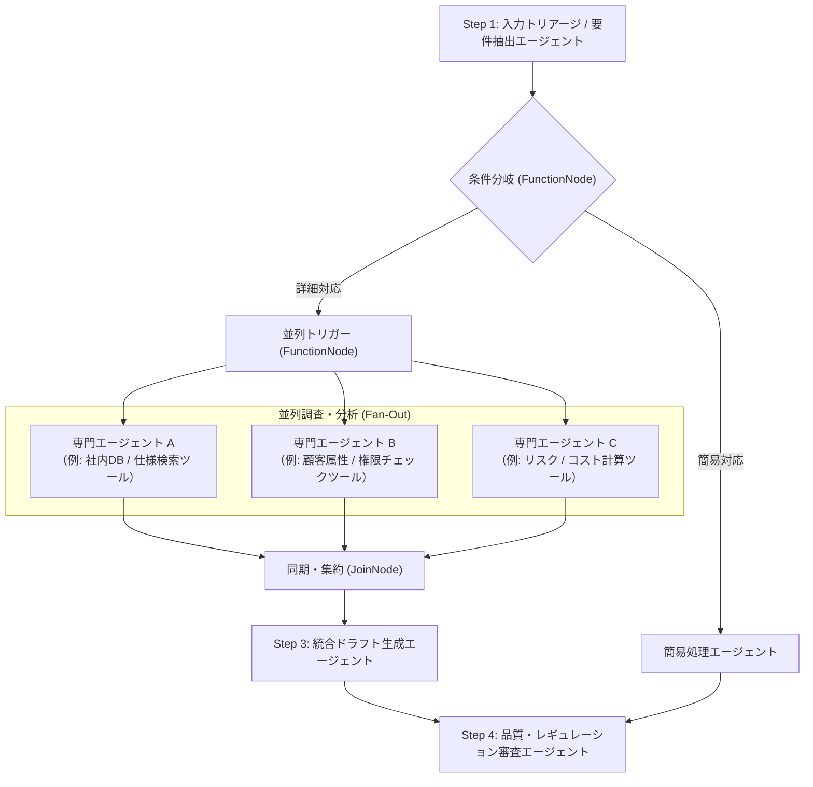

# ADK 2.0 マルチエージェント開発 初心者向け徹底解説ガイド

Google のエージェント開発フレームワーク **Agent Development Kit (ADK) 2.0** では、従来の単一エージェントや単純な会話委譲にとどまらず、**グラフベースのワークフロー（`Workflow`）** によって高度なマルチエージェントシステムを直感的に構築できるようになりました。

本ガイドは、ADK 2.0 の基本概念からコードの書き方、マルチエージェントの連携制御までを初心者向けにわかりやすく解説したドキュメントです。  
実際のリファレンス実装である `customer_support/agent.py` のコードと見比べながら読み進めることで、実践的な書き方を身につけることができます。

---

## 目次

1. [ADK 2.0 とは？（従来型との違い）](#1-adk-20-とは従来型との違い)
2. [全体像の把握：サンプルシステムの構造](#2-全体像の把握サンプルシステムの構造)
3. [基本要素①：専門エージェントを作る (`LlmAgent`)](#3-基本要素専門エージェントを作る-llmagent)
4. [基本要素②：ツールを持たせる (`tools` と Python 関数)](#4-基本要素ツールを持たせる-tools-と-python-関数)
5. [基本要素③：データを受け渡す (`output_key` とセッションステート)](#5-基本要素データを受け渡す-output_key-とセッションステート)
6. [基本要素④：処理を制御する (`FunctionNode` と `JoinNode`)](#6-基本要素処理を制御する-functionnode-と-joinnode)
7. [ワークフローの組み立て (`Workflow` と `edges`)](#7-ワークフローの組み立て-workflow-と-edges)
8. [エージェントの公開ルールとディレクトリ設計](#8-エージェントの公開ルールとディレクトリ設計)
9. [Web UI (`adk web`) での動作確認と観察ポイント](#9-web-ui-adk-web-での動作確認と観察ポイント)
10. [【実践ガイド①】新エージェント作成時のプロンプト設計とファイル構成・書き方](#10-実践ガイド新エージェント作成時のプロンプト設計とファイル構成書き方)
11. [【実践ガイド②】`LlmAgent` のツール（`tools`）書き換え・自作完全攻略](#11-実践ガイドllmagent-のツールtools書き換え自作完全攻略)
12. [【即効レシピ】3ステップでできる！ハッカソン頻出カスタマイズ](#12-即効レシピ3ステップでできるハッカソン頻出カスタマイズ)
13. [ハマりやすい失敗例とトラブルシューティング](#13-ハマりやすい失敗例とトラブルシューティング)
14. [まとめ & ADK 2.0 クイックチートシート](#14-まとめ--adk-20-クイックチートシート)

---

## 1. ADK 2.0 とは？（従来型との違い）

AI エージェントを業務システムに組み込む際、1つの巨大なプロンプトや1つのエージェントにすべてを任せると、以下のような課題が生じます。

- プロンプトが肥大化し、指示の精度が落ちる
- どの順番でツールを呼び、どのように推論したのか追跡しにくい
- 独立して調査できるタスクを直列に行うためレスポンスが遅い

ADK 2.0 では、**専門性を持った複数の小さなエージェント（`LlmAgent`）** と **制御ノード（`FunctionNode` / `JoinNode`）** を **グラフ（`Workflow`）** として組み合わせることで、複雑な業務フローを安定的・高速に実行できます。

| 比較項目 | 従来の単一/委譲型エージェント | ADK 2.0 グラフベース `Workflow` |
| :--- | :--- | :--- |
| **役割分担** | 1つのエージェントが何でもこなす | 各エージェントが単一の専門業務に特化 |
| **処理フロー** | LLM の気まぐれな会話委譲に依存 | 開発者がノードとエッジ（グラフ）で明示的に制御 |
| **並列処理** | 困難（逐次実行のみ） | **Fan-Out（並列実行）と Fan-In（集約）が容易** |
| **デバッグ性** | どこで失敗したか特定しにくい | 各ノードのステートや入出力が可視化される |

---

## 2. 全体像の把握：サンプルシステムの構造

本リポジトリの `customer_support/agent.py` では、「**カスタマーサポートにおける問い合わせ自動トリアージ＆回答ドラフト作成**」を題材に、ADK 2.0 の主要パターンを網羅しています。

### ワークフローの全体図


### `customer_support/agent.py` の構成ブロック

`customer_support/agent.py` は大きく以下の4つのブロックで書かれています。

1. **インポートと環境設定**（ライブラリ読み込み、モデル指定）
2. **専門エージェントの定義 (`LlmAgent`)**（各ステップの担当エージェント作成）
3. **制御ノードの定義 (`FunctionNode` / `JoinNode`)**（分岐や集約の仕組み）
4. **ワークフローの組み立て (`Workflow` & `edges`)**（グラフ構造の定義）

それでは、1つずつコードを見ながら解説していきます。

---

## 3. 基本要素①：専門エージェントを作る (`LlmAgent`)

`LlmAgent` は、LLM（Gemini）を利用して推論、指示の実行、ツール呼び出しを行うエージェントの基本単位です。

### コード例（`customer_support/agent.py` より抜粋）

```python
# customer_support/agent.py
# Step 1: トリアージエージェント (構造化出力: TriageResult)
triage_agent = LlmAgent(
    name="triage_agent",
    model=gemini_model,
    instruction=TRIAGE_INSTRUCTION,
    output_schema=TriageResult,  # ★ Pydantic による構造化出力
    output_key="triage_result",
    description="顧客からの問い合わせ内容を分析し、カテゴリ分類と緊急度を判定するエージェント",
)
```

### パラメータの解説

| 引数名 | 型 | 説明 |
| :--- | :--- | :--- |
| `name` | `str` | エージェントの一意な識別名。Web UI やログでこの名前が表示されます。 |
| `model` | `Gemini / str` | 使用する LLM モデルインスタンスまたはモデル名（例: `"gemini-3.7-flash"`）。 |
| `instruction` | `str` | エージェントに対する指示（システムプロンプト）。役割や出力形式を定義します。 |
| `output_schema`| `Type[BaseModel]` | **【構造化出力】** Pydantic モデル等を指定し、LLM の出力フォーマットを厳密に制約・型定義します。 |
| `tools` | `list` | エージェントが実行できる Python 関数のリスト（Tool Calling）。省略可。 |
| `output_key` | `str` | **【重要】** エージェントの生成結果をセッションステート（メモリ）に保存するキー名。 |
| `description` | `str` | エージェントの簡単な説明（概要）。 |

> [!TIP]
> **エージェント設計のベストプラクティス**  
> 1つのエージェントに「分類もして、検索もして、ドラフトも書いて、チェックもして」と詰め込まず、「トリアージ専門」「ナレッジ検索専門」「回答作成専門」のように**単一責任（1エージェント1役割）**で分割するのがコツです。

---

## 4. 基本要素②：ツールを持たせる (`tools` と Python 関数)

エージェントに外部データベースの検索や API 呼び出しを行わせたい場合は、通常の Python 関数を定義して `tools=[...]` に渡します。

### ツールの定義例（`customer_support/tools/knowledge_tool.py` より抜粋）

```python
def search_knowledge_base(query: str, category: str = "") -> str:
    """社内ナレッジベースおよびFAQから、問い合わせ内容に関連する記事を検索します。

    Args:
        query: 検索キーワードや問い合わせ内容の要約（例: "レート制限 429"）
        category: 絞り込みカテゴリ（オプション。例: "技術的課題", "契約/請求"）

    Returns:
        検索結果の一覧（Markdownテキスト形式）。該当記事がない場合は汎用案内を返します。
    """
    # ...（Pythonによる検索処理）...
    return results_text
```

### エージェントへのツール紐付け（`customer_support/agent.py` より抜粋）

```python
# customer_support/agent.py: L65-73
knowledge_search_agent = LlmAgent(
    name="knowledge_search_agent",
    model=MODEL_NAME,
    instruction=KNOWLEDGE_INSTRUCTION,
    tools=[search_knowledge_base],   # ← ここに関数をリストで指定するだけ！
    output_key="knowledge_result",
    description="社内FAQやナレッジベースから解決に関連する技術情報・仕様を検索するエージェント",
)
```

### 💡 初心者が知っておくべき「ツール化のルール」

1. **型ヒント（Type Annotations）を必ず書く**  
   引数の `query: str` や戻り値の `-> str` を明記することで、ADK が自動的に LLM 向けスキーマ（JSON Schema）に変換します。
2. **docstring（関数の説明文）を丁寧に書く**  
   LLM は関数の docstring を読んで「いつ、どんな引数を渡してこのツールを呼ぶべきか」を判断します。引数（`Args`）の説明も忘れずに記述しましょう。
3. **戻り値は文字列または辞書にする**  
   ツールの実行結果は LLM にテキストとして渡されるため、`str` や `dict` を返すのが一般的です。

---

## 5. 基本要素③：データを受け渡す (`output_key` とセッションステート)

マルチエージェントで最も重要なのは、「**前段のエージェントが調べた結果を、後続のエージェントにどうやって伝えるか**」です。

ADK 2.0 では、**セッションステート（`ctx.state`）** と **プロンプト内プレースホルダー** を使ってシームレスにデータを受け渡します。

### ステップ 1: `output_key` で保存する
エージェントに `output_key="triage_result"` と指定すると、そのエージェントの出力が自動的にセッションステートの `"triage_result"` というキーに保存されます。

### ステップ 2: 後続エージェントのプロンプト内で `{キー名?}` で参照する

後続の回答ドラフト作成エージェントのプロンプト（`customer_support/prompts/draft.py`）を見てみましょう。

```python
# customer_support/prompts/draft.py より抜粋
DRAFT_INSTRUCTION = """あなたはカスタマーサポートの「回答ドラフト作成専門エージェント」です。
前段の各専門エージェントから収集された分析結果を統合し、完成度の高い返信案を作成してください。

【各エージェントの分析結果】
■ 1. トリアージ結果:
{triage_result?}

■ 2-A. ナレッジ・技術調査結果:
{knowledge_result?}

■ 2-B. 顧客・契約情報:
{customer_result?}

■ 2-C. 感情・リスク評価:
{risk_result?}

【あなたのタスク】
...
"""
```

> [!NOTE]
> **なぜ `{triage_result?}` のように `?` をつけるのか？**  
> 末尾に `?` をつけることで、もし該当するキーがステートにまだ存在しない場合でも、エラーにならず「空文字」として安全に展開されます（Optional プレースホルダー構文）。

---

## 6. 基本要素④：処理を制御する (`FunctionNode` と `JoinNode`)

LLM ではなく、**Python ロジックによる条件分岐** や **並列処理の集約** を行うためのノードが `FunctionNode` と `JoinNode` です。

### 1. `FunctionNode`: 条件分岐（Routing）の作成

問い合わせ内容に応じて「詳細調査へ進む」か「簡易返信（クイック）で済ませる」かを判定するノードです。構造化出力（`TriageResult`）を利用することで、型安全かつ確実に条件分岐を行えます。

```python
# customer_support/agent.py
def decide_route(ctx: Context, node_input: Any = None) -> str:
    """トリアージ結果に基づいて後続のルート（詳細調査 or クイック返信）を決定します。"""
    triage_raw = ctx.state.get("triage_result") or node_input

    category = ""
    urgency = ""

    # Pydantic モデル、辞書、または JSON 文字列から安全にフィールドを取得
    if isinstance(triage_raw, TriageResult):
        category = triage_raw.category
        urgency = triage_raw.urgency
    elif isinstance(triage_raw, dict):
        category = triage_raw.get("category", "")
        urgency = triage_raw.get("urgency", "")
    elif isinstance(triage_raw, str):
        try:
            parsed = TriageResult.model_validate_json(triage_raw)
            category = parsed.category
            urgency = parsed.urgency
        except Exception:
            if "カテゴリ: その他" in triage_raw or "その他" in triage_raw:
                category = "その他"
            if "緊急度: 低" in triage_raw or "低" in triage_raw:
                urgency = "低"

    # カテゴリが「その他」かつ緊急度が「低」の場合はクイック返信へ
    if category == "その他" and urgency == "低":
        ctx.route = "quick_reply"   # ← 分岐先のキー名をセット！
    else:
        ctx.route = "deep_check"    # ← 分岐先のキー名をセット！

    return f"Selected route: {ctx.route}"

# ノードとしてインスタンス化
route_decision_node = FunctionNode(
    name="route_decision_node",
    func=decide_route,
)
```

- **`ctx.route`**: このプロパティに文字列（例: `"deep_check"`）を代入すると、後述のワークフロー定義にある対応したエッジへ進みます。
- **`ctx.state`**: 過去の全ノードが保存したデータにアクセスできます。

### 2. `parallel_trigger`: 並列処理への分配ノード

複数のエージェントを同時に動かす（Fan-Out）際の起点となるノードです。

```python
# customer_support/agent.py
def pass_through_trigger(ctx: Context, node_input: Any = None) -> str:
    """Fan-Out（並列実行）用のトリガーノード。入力をそのまま後続エージェントへ中継します。"""
    return str(node_input)

parallel_trigger = FunctionNode(
    name="parallel_trigger",
    func=pass_through_trigger,
)
```

### 3. `JoinNode`: 並列ブランチの同期・集約（Fan-In）

並列実行された複数のエージェント（ナレッジ検索、顧客照会、リスク分析）は、完了するタイミングが異なります。  
`JoinNode` を置くことで、**接続されているすべての並列処理が完了するのを待機し、揃った段階で後続ノードを1回だけ呼び出す**ことができます。

```python
# customer_support/agent.py: L164-167
gather_research = JoinNode(
    name="gather_research",
)
```

---

## 7. ワークフローの組み立て (`Workflow` と `edges`)

定義したエージェントと制御ノードを接続し、完成したグラフを `Workflow` に登録します。

### ワークフローのコード（`customer_support/agent.py` より抜粋）

```python
# customer_support/agent.py: L173-203
root_agent = Workflow(
    name="customer_support_workflow",
    description="ADK 2.0 グラフベースのカスタマーサポート問い合わせ自動トリアージ＆回答ドラフト作成ワークフロー",
    edges=[
        # --- (A) 条件分岐 (Routing) ---
        (
            START,
            triage_agent,
            route_decision_node,
            {
                "deep_check": parallel_trigger,       # ctx.route が "deep_check" の場合の進み先
                "quick_reply": quick_response_agent, # ctx.route が "quick_reply" の場合の進み先
            },
        ),

        # --- (B) Fan-Out（並列実行） ---
        # parallel_trigger から 3 つの調査エージェントへ同時に分岐
        (parallel_trigger, knowledge_search_agent, gather_research),
        (parallel_trigger, customer_info_agent, gather_research),
        (parallel_trigger, risk_analysis_agent, gather_research),

        # --- (C) Fan-In（同期・集約） & ドラフト作成 ---
        # 3つの調査が完了したら gather_research からドラフト作成 -> 品質チェックへ
        (gather_research, draft_creation_agent, quality_check_agent),

        # --- (D) クイック返信ルートの品質チェック ---
        # クイック返信エージェントの出力も最終的に品質チェックを通す
        (quick_response_agent, quality_check_agent),
    ],
)

# エイリアス
workflow = root_agent
```

### `edges` の書き方パターンまとめ

ADK 2.0 では、タプルを使ってノード間の接続を直感的に記述できます。

| パターン | エッジの書き方 | 意味 |
| :--- | :--- | :--- |
| **順次実行 (Sequential)** | `(node_a, node_b, node_c)` | `node_a` が終わったら `node_b`、次に `node_c` を実行 |
| **条件分岐 (Routing)** | `(node_a, route_node, {"key1": dest1, "key2": dest2})` | `route_node` の `ctx.route` の値に応じて `dest1` または `dest2` に進む |
| **並列実行 (Fan-Out)** | `(trigger, branch1, gather)`<br/>`(trigger, branch2, gather)` | `trigger` から `branch1` と `branch2` が同時に起動し、両方とも `gather` に合流 |
| **同期集約 (Fan-In)** | `(gather_join_node, next_node)` | すべての並列ブランチの終了を待ってから `next_node` を実行 |

---

## 8. エージェントの公開ルールとディレクトリ設計

ADK がエージェントを自動認識して実行できるようにするための重要な設計ルールです。

### 1. `root_agent` の定義
ADK は各パッケージ内から **`root_agent`**（または `workflow`）という名前の変数を探してワークフローのエントリポイントとして読み込みます。

```python
# customer_support/__init__.py
from .agent import root_agent

__all__ = ["root_agent"]
```

### 2. ディレクトリ名と命名規則（⚠️ 最大の注意点）

ADK は Python の動的インポート（`importlib`）を使ってエージェントをロードします。そのため、**エージェントのフォルダ名は必ず Python の有効な識別子（半角英数字とアンダースコア `_` のみ）** にする必要があります。

```text
❌ 悪い例: customer-support/     (ハイフンが含まれているためインポートエラーになる)
✅ 良い例: customer_support/     (アンダースコアを使用する)
```

> [!IMPORTANT]
> リポジトリ名自体にハイフンが含まれている場合（例: `adk-hackason`）でも、リポジトリ直下に `customer_support/` のようなパッケージフォルダを配置する構成にすれば問題なく動作します。

---

## 9. Web UI (`adk web`) での動作確認と観察ポイント

実装したエージェントは、ADK 付属の Web UI を使ってブラウザ上で対話しながらテストできます。

### 起動コマンド

```bash
# Cloud Shell またはリモート環境での起動コマンド
adk web --port 8080 --allow_origins="regex:.*"
```

> [!TIP]
> `--allow_origins="regex:.*"` を付与することで、Cloud Shell の「ウェブでプレビュー」機能などの外部ホスト名経由でも 403 Forbidden エラーにならずにアクセスできます。

### Web UI での観察ポイント

1. **左側パネルでエージェントを選択**：`customer_support` が選択されていることを確認します。
2. **チャット欄に問い合わせを入力**：例として「*株式会社サンプル商事の佐藤です。APIを呼び出したらHTTP 429エラーが発生して困っています。*」と送信します。
3. **ノードの実行フローを確認**：
   - `triage_agent` がカテゴリを「技術的課題」、緊急度を「高」と判定
   - `route_decision_node` が `deep_check` ルートを選択
   - 3つのエージェント（ナレッジ検索、顧客照会、リスク分析）が**並列で Tool Calling や推論を実行**
   - `gather_research`（JoinNode）で集約された後、`draft_creation_agent` が全情報を取り入れた回答を作成
   - `quality_check_agent` が最終チェックを行い、回答が出力される

## 10. 【実践ガイド①】新エージェント作成時のプロンプト設計とファイル構成・書き方

ハッカソンで「営業提案書自動作成」「IT障害対応」「契約書レビュー」「社内ITヘルプデスク」など、**全く新しいテーマのマルチエージェントをゼロから構築する際、どのようにファイルを配置し、どのようにプロンプトを記述・連携させればよいか** を順を追って解説します。

---

### 1. 推奨されるディレクトリ・ファイル構成

ADK 2.0 では、プロンプトを `agent.py` 内に直書きするのではなく、**`prompts/` ディレクトリに 1 エージェント 1 ファイルとして分離管理する** のが最も見通しが良く、チーム開発でも競合を防げるベストプラクティスです。

```text
my_sales_agent/                # ← あなたの作成するエージェントフォルダ（半角英数字と _ のみ）
├── __init__.py                # root_agent を外部公開するエントリポイント
├── agent.py                   # LlmAgent の定義と Workflow のグラフ構築
├── prompts/                   # ★ プロンプト専用ディレクトリ
│   ├── __init__.py            # 各プロンプト変数をまとめてインポート・再公開
│   ├── triage.py              # Step 1: 要件抽出・トリアージ用プロンプト
│   ├── case_search.py         # Step 2-A: 過去事例検索用プロンプト
│   ├── customer_check.py      # Step 2-B: 顧客属性・予算分析用プロンプト
│   ├── draft.py               # Step 3: 提案書ドラフト生成用プロンプト
│   └── review.py              # Step 4: 最終レビュー・品質チェック用プロンプト
└── tools/                     # ★ ツール専用ディレクトリ（Python関数）
    ├── __init__.py
    ├── case_tool.py
    └── pricing_tool.py
```

---

### 2. プロンプトファイル（`prompts/*.py`）の書き方と基本テンプレート

各プロンプトファイルでは、`XXX_INSTRUCTION` という文字列定数を定義します。  
ADK 2.0 のマルチエージェントで高品質な出力を得るための **「プロンプト 4 大構成要素」** を押さえて記述しましょう。

```python
# prompts/triage.py の例
"""Step 1: 要件抽出・トリアージエージェントのプロンプト"""

TRIAGE_INSTRUCTION = """あなたは【提案書作成支援システム】の「要件抽出・トリアージ専門エージェント」です。
ユーザーから入力された相談内容を分析し、提案に必要な要件を整理してください。

【1. あなたの役割】
- ユーザーの目的、課題感、予算感、希望納期などの基本要件を整理する。
- 提案のカテゴリ（「新規開発」「クラウド移行」「運用保守」「コンサル」等）を判定する。

【2. 抽出項目】
- 顧客名 / 企業名:
- 提案カテゴリ:
- 抱えている主要課題:
- 制約事項（予算、期間、技術スタック等）:
- 後続エージェントへの調査指示:

【3. 出力フォーマット】
以下の形式に厳密に従って出力してください:
========================================
[要件整理サマリ]
- 企業名: <企業名または「不明」>
- カテゴリ: <カテゴリ名>
- 課題要約: <2〜3行で要約>
- 調査方針: <後続の事例検索・分析エージェントで重点的に調べるべき項目>
========================================
"""
```

---

### 3. 前段エージェントの出力を後段エージェントに渡すプロンプトの書き方（データの連動）

マルチエージェントの真骨頂は、「**前段のエージェントが調査・抽出した結果を、後続のエージェントがプロンプト内で受け取って処理する**」点にあります。

後続エージェント（例: ドラフト生成エージェント）のプロンプトでは、**`{前段エージェントのoutput_key名?}`** と書くことで、セッションステートのデータを自動的に埋め込むことができます。

```python
# prompts/draft.py の例
"""Step 3: 提案書ドラフト作成エージェントのプロンプト"""

DRAFT_INSTRUCTION = """あなたは【提案書作成支援システム】の「提案書ドラフト作成専門エージェント」です。
前段の専門エージェント群が収集・分析した以下の調査結果をすべて統合し、顧客に提出できる完成度の高い提案書を作成してください。

【前段エージェントからの入力データ】
■ 1. 初期要件・トリアージ結果:
{triage_result?}

■ 2-A. 過去の類似導入事例:
{case_result?}

■ 2-B. 顧客属性 & 予算・価格試算:
{pricing_result?}

【作成指示】
上記のデータを漏れなく反映し、以下の章立てで提案書ドラフトを作成してください:
1. はじめに（貴社の現状課題に対する認識）
2. 本提案のコンセプトと提供価値
3. 具体的なソリューション構成（過去事例 {case_result?} の実績に基づく根拠を明記）
4. 概算費用とお見積もり内訳（{pricing_result?} の計算結果を反映）
5. 今後の進め方とネクストアクション
"""
```

> [!TIP]
> **なぜ `{キー名?}` と末尾に `?` を付けるのか？**  
> `?` を付けておくことで、万が一そのエージェントが分岐等でスキップされてステート内にデータが存在しない場合でも、KeyError エラーにならず安全に「空文字」として展開されます（Optional プレースホルダー構文）。

---

### 4. `prompts/__init__.py` でプロンプトをまとめてエクスポートする

`prompts/` フォルダ内の `__init__.py` に、各ファイルで定義したプロンプト変数をまとめてインポート・公開します。これにより、`agent.py` から 1 行で美しくインポートできるようになります。

```python
# prompts/__init__.py
from .triage import TRIAGE_INSTRUCTION
from .case_search import CASE_SEARCH_INSTRUCTION
from .customer_check import CUSTOMER_CHECK_INSTRUCTION
from .draft import DRAFT_INSTRUCTION
from .review import REVIEW_INSTRUCTION

__all__ = [
    "TRIAGE_INSTRUCTION",
    "CASE_SEARCH_INSTRUCTION",
    "CUSTOMER_CHECK_INSTRUCTION",
    "DRAFT_INSTRUCTION",
    "REVIEW_INSTRUCTION",
]
```

---

### 5. `agent.py` でプロンプトを `LlmAgent` に組み込む（キー名の紐付け）

最後に、`agent.py` で各エージェントをインスタンス化します。  
ここで指定する **`output_key` の文字列** が、後続エージェントのプロンプト内で参照する **`{キー名?}`** と完全に一致するように紐付けます。

```python
# agent.py
from google.adk.agents import LlmAgent
from google.adk.models import Gemini
from google.adk.workflow import Workflow, FunctionNode, JoinNode, START

# 1. プロンプトのインポート
from .prompts import (
    TRIAGE_INSTRUCTION,
    CASE_SEARCH_INSTRUCTION,
    CUSTOMER_CHECK_INSTRUCTION,
    DRAFT_INSTRUCTION,
    REVIEW_INSTRUCTION,
)
# 2. ツールのインポート（自作関数）
from .tools import search_case_studies, calculate_pricing

# モデルの初期化
gemini_model = Gemini(model="gemini-3.7-flash", client_kwargs={"location": "global"})

# ----------------------------------------------------------------------
# 各専門エージェントの定義
# ----------------------------------------------------------------------

# Step 1: 要件抽出エージェント
triage_agent = LlmAgent(
    name="triage_agent",
    model=gemini_model,
    instruction=TRIAGE_INSTRUCTION,
    output_key="triage_result",   # ★ このキー名でセッションステートに保存される
    description="依頼文から要件を抽出・整理するエージェント",
)

# Step 2-A: 過去事例検索エージェント（ツール使用）
case_search_agent = LlmAgent(
    name="case_search_agent",
    model=gemini_model,
    instruction=CASE_SEARCH_INSTRUCTION,
    tools=[search_case_studies],  # 自作の事例検索ツール
    output_key="case_result",     # ★ 後続の {case_result?} に渡る
    description="社内DBから類似事例を検索するエージェント",
)

# Step 2-B: 価格試算エージェント（ツール使用）
pricing_agent = LlmAgent(
    name="pricing_agent",
    model=gemini_model,
    instruction=CUSTOMER_CHECK_INSTRUCTION,
    tools=[calculate_pricing],    # 自作の見積もり計算ツール
    output_key="pricing_result",  # ★ 後続の {pricing_result?} に渡る
    description="要件に合わせた概算見積もりを計算するエージェント",
)

# Step 3: ドラフト作成エージェント（Fan-In後の集約エージェント）
draft_agent = LlmAgent(
    name="draft_agent",
    model=gemini_model,
    instruction=DRAFT_INSTRUCTION, # ★ プロンプト内で {triage_result?}, {case_result?}, {pricing_result?} を参照
    output_key="draft_result",
    description="各調査結果を統合して提案書ドラフトを作成するエージェント",
)

# Step 4: 最終レビューエージェント
review_agent = LlmAgent(
    name="review_agent",
    model=gemini_model,
    instruction=REVIEW_INSTRUCTION,
    output_key="final_result",
    description="提案書のトーン＆マナーや記載漏れを最終チェックするエージェント",
)
```

---

### 6. 【テーマ別】ハッカソンで使えるプロンプト設計テンプレート集

ハッカソンでよく選ばれる人気テーマのプロンプト設計・データ受け渡し例です。自分たちのテーマに合わせて自由にカスタマイズしてください。

#### 🏢 テーマ A: 「IT障害インシデント初動対応エージェント」
- **Step 1: アラートトリアージ (`triage_agent`)**: アラートログから影響サービス、エラー種別（5xx系、DB遅延等）、障害レベル（P1〜P3）を判定 ➔ `output_key="alert_summary"`
- **Step 2-A: 過去障害ナレッジ検索 (`incident_kb_agent`)**: 過去の類似インシデントと復旧手順書（Runbook）を検索 ➔ `output_key="runbook_result"`
- **Step 2-B: 影響範囲・ユーザー照会 (`impact_agent`)**: 影響を受けている契約企業数やSLA要件を照会 ➔ `output_key="impact_result"`
- **Step 3: 初動周知文 & 復旧手順ドラフト (`draft_agent`)**: `{alert_summary?}`, `{runbook_result?}`, `{impact_result?}` を統合して Slack 向け初動報告文を作成
- **Step 4: レビュー (`review_agent`)**: 重大情報の誤記載や不適切な表現がないかチェック

#### ⚖️ テーマ B: 「契約書・利用規約リーガルレビューエージェント」
- **Step 1: 契約類型判定 (`contract_triage`)**: 秘密保持契約(NDA)、業務委託、SaaS利用規約などの類型を判定 ➔ `output_key="contract_type"`
- **Step 2-A: 自社法務基準照会 (`legal_guideline_agent`)**: 自社のリスク許容基準・NG条項リストを照会 ➔ `output_key="guideline_result"`
- **Step 2-B: リスク条項抽出 (`risk_clause_agent`)**: 損害賠償上限、競業避止、知財帰属などの不利な条項を抽出 ➔ `output_key="risk_clauses"`
- **Step 3: 修正条項案作成 (`draft_amendment_agent`)**: `{guideline_result?}` と `{risk_clauses?}` に基づき、相手方への修正要求案を作成
- **Step 4: 弁護士トーンレビュー (`review_agent`)**: 丁寧かつ毅然とした交渉文面になっているか確認

---

## 11. 【実践ガイド②】`LlmAgent` のツール（`tools`）書き換え・自作完全攻略

ADK 2.0 では、通常の Python 関数を定義して `LlmAgent(tools=[関数名])` に渡すだけで、Gemini が状況に応じて自律的にその関数を実行（Tool Calling / Function Calling）します。

### 1. ツールの基本構造と 3 大原則

```mermaid
flowchart LR
    User["ユーザー入力"] --> Agent["LlmAgent (Gemini)"]
    Agent -->|1. 引数を決めて呼出| ToolFunc["Python 関数 (Tool)"]
    ToolFunc -->|2. 実行結果 (str/dict)| Agent
    Agent -->|3. 結果を踏まえて回答| Output["最終出力"]
```

ツール関数を作成・修正する際は、以下の 3 原則を守る必要があります。

1. **型ヒント（Type Annotation）を明記する**: 引数 (`query: str, count: int`) や戻り値 (`-> str`) の型を省略すると、LLM がスキーマを認識できず呼び出しに失敗する可能性があります。
2. **docstring に「いつ呼ぶか」「引数の意味」を詳しく書く**: LLM は関数の説明文（docstring）だけを読んでツールを使うべきか判断します。
3. **戻り値はわかりやすいテキスト（または JSON / dict）にする**: 戻り値はそのまま LLM のコンテキスト（推論材料）に入ります。

---

### 書き換え実例 ①：既存ツールのモックデータを自社の業務データに書き換える（Before / After）

#### 🛠️ 対象ファイル: `customer_support/tools/knowledge_tool.py`
ハッカソンで手軽に独自の業務知識を持たせたい場合、`KNOWLEDGE_BASE` リストを書き換えるのが最短ルートです。

**▼ Before（APIエラーなどのサポートFAQ）**
```python
KNOWLEDGE_BASE: List[Dict[str, str]] = [
    {
        "id": "KB-001",
        "category": "技術的課題",
        "title": "APIレート制限（429 Too Many Requests）の仕様と対処法",
        "content": "Standardプランは1分あたり60リクエスト、Enterpriseプランは1分あたり300リクエスト...",
    },
]
```

**▼ After（書き換え例：社内経費精算・人事労務ナレッジに変更）**
```python
KNOWLEDGE_BASE: List[Dict[str, str]] = [
    {
        "id": "HR-001",
        "category": "経費精算",
        "title": "リモートワーク手当およびカフェ利用費の精算基準",
        "content": (
            "【支給対象】全正社員。月額上限5,000円まで。\n"
            "【精算手順】経費精算システム（Concur）にて領収書PDFを添付し「リモートワーク補助」を選択して申請してください。\n"
            "【対象外】アルコール飲料代、業務時間外の利用、コンビニ購入の軽食代は対象外です。"
        ),
    },
    {
        "id": "HR-002",
        "category": "休暇・勤怠",
        "title": "夏季特別休暇の取得ルールと有効期限",
        "content": (
            "【付与日数】毎年7月1日に3日間の有給特別休暇が付与されます。\n"
            "【取得期間】7月1日〜9月30日までの間に分割または連続して取得可能です。"
        ),
    },
]
```

> **💡 こう変わる！（実行結果の変化）**  
> 「カフェで仕事した分の経費って落とせますか？」と Web UI で質問すると、エージェントが自動的に `HR-001` の記事を検索し、「月額上限5,000円まで申請可能ですが、アルコールや軽食は対象外です」と正確に案内してくれるようになります。

---

### 書き換え実例 ②：新しい自作ツールを 1 から作成してエージェントに持たせる

例として、プランごとの見積もり金額や割引率を自動計算する **「料金シミュレーションツール」** を新設してみましょう。

#### Step 1: ツール関数を定義する (`customer_support/tools/calc_tool.py` などを新規作成)

```python
# customer_support/tools/calc_tool.py
def calculate_quote(plan_name: str, user_count: int, is_annual: bool = True) -> str:
    """ユーザー数と契約プランに基づいて、月額費用・年間費用およびボリューム割引を計算します。

    Args:
        plan_name: 契約プラン名（'Standard' または 'Enterprise'）
        user_count: 利用ユーザー数（例: 50）
        is_annual: 年間一括払いかどうか（True の場合は15%割引が適用されます）

    Returns:
        計算結果の見積もりサマリテキスト
    """
    # 基本単価の設定
    unit_price = 1500 if "standard" in plan_name.lower() else 4000
    subtotal = unit_price * user_count

    # ボリューム割引率の判定
    discount_rate = 0.0
    if user_count >= 100:
        discount_rate = 0.20  # 100名以上で20%OFF
    elif user_count >= 50:
        discount_rate = 0.10  # 50名以上で10%OFF

    # 年間払い割引（追加15%OFF）
    annual_discount = 0.15 if is_annual else 0.0
    total_discount_rate = discount_rate + annual_discount

    final_monthly_price = int(subtotal * (1.0 - total_discount_rate))
    total_annual_price = final_monthly_price * 12

    return (
        f"【お見積もり試算結果】\n"
        f"- プラン: {plan_name}（単価: ¥{unit_price:,}/ユーザー）\n"
        f"- ご利用人数: {user_count} 名\n"
        f"- 適用割引: 合計 {int(total_discount_rate * 100)}% OFF (ボリューム割: {int(discount_rate * 100)}% + 年間割: {int(annual_discount * 100)}%)\n"
        f"- 月額費用: ¥{final_monthly_price:,}（税抜）\n"
        f"- 年間総額: ¥{total_annual_price:,}（税抜）"
    )
```

#### Step 2: `customer_support/agent.py` でエージェントにツールを登録する

```python
# customer_support/agent.py
# 1. 作成したツールをインポート
from .tools.calc_tool import calculate_quote

# 2. ツールを持ったエージェントを定義
quote_agent = LlmAgent(
    name="quote_agent",
    model=gemini_model,
    instruction="""あなたは料金見積もり専門エージェントです。
顧客の問い合わせからプラン名や希望人数を読み取り、必ず `calculate_quote` ツールを実行して正確な金額を試算してください。
試算結果をわかりやすくフォーマットして出力してください。""",
    tools=[calculate_quote],   # ← ここに自作関数を渡す！
    output_key="quote_result",
)
```

> **💡 こう変わる！（実行結果の変化）**  
> LLM は複雑な掛け算や割引率の計算を間違えやすいですが、Python 関数（ツール）側で厳密に計算させることで、**1円の狂いもない正確な見積もり金額**を回答できるようになります。

---

### 書き換え実例 ③：docstring の書き方で LLM の挙動はどう変わるか？（良例 vs 悪例）

Gemini は **docstring を読んで Tool Calling のパラメータを生成** します。書き方次第でツールの精度が劇的に変わります。

| 項目 | ❌ 悪い例（エラーや不発の原因） | ✅ 良い例（確実に正しく呼ばれる） |
| :--- | :--- | :--- |
| **型ヒント** | `def search_db(q, cat):` （型がない） | `def search_db(query: str, category: str = "") -> str:` |
| **関数の説明** | `"""検索します"""` | `"""社内FAQおよびトラブルシューティング記事を検索します。該当記事がない場合は空を返します。"""` |
| **引数の説明** | なし | `Args:\n    query: 検索キーワード（例: "429 エラー"）\n    category: "技術" または "契約"` |
| **呼出の誘導** | なし | `docstring または instruction に「〇〇に関する質問の際は必ずこのツールを呼ぶこと」と明記` |

---

## 12. ハッカソン頻出カスタマイズ

### レシピ 1: 新しいツールを作ってエージェントに追加する（所要時間: 3分）

1. **`customer_support/tools/` に関数を書く**
   - 型ヒントと docstring（Args, Returns）を必ず記載する。
2. **`customer_support/tools/__init__.py` で公開する**
   - `from .my_tool import my_function` を追記。
3. **`customer_support/agent.py` の `LlmAgent(tools=[my_function])` に追加する**
   - プロンプトにも「必要に応じて `my_function` ツールを使用してください」と一言添える。

---

### レシピ 2: 新しい並列エージェント（Fan-Out）をワークフローに追加する（所要時間: 5分）

例えば「**競合製品との比較・リプレイス提案エージェント**」を並列調査に追加したい場合：

1. **`customer_support/prompts/competitor.py` を作成**
   ```python
   COMPETITOR_INSTRUCTION = """あなたは競合製品分析エージェントです。
   問い合わせ文に他社製品（A社、B社など）の名前があれば、自社製品の強みと差別化ポイントを提示してください。"""
   ```
2. **`customer_support/agent.py` でエージェントを定義**
   ```python
   competitor_agent = LlmAgent(
       name="competitor_agent",
       model=gemini_model,
       instruction=COMPETITOR_INSTRUCTION,
       output_key="competitor_result",
   )
   ```
3. **`Workflow.edges` の並列ブランチに追加**
   ```python
   edges = [
       # ...
       # 既存の並列エージェントに並べて 1 行追加するだけ！
       (parallel_trigger, competitor_agent, gather_research),
       # ...
   ]
   ```
4. **後続の `DRAFT_INSTRUCTION` にプレースホルダー `{competitor_result?}` を追加**

---

### レシピ 3: ワークフロー全体を「別テーマ」に作り変える雛形

カスタマーサポート以外のテーマ（営業支援・コードレビュー・社内ヘルプデスク等）に作り変える際の基本マッピングです。



---

## 13. ハマりやすい失敗例とトラブルシューティング

ハッカソン中に受講者が遭遇しやすいトラブルと、その解決策です。

### 1. ツールがまったく呼び出されない
- **原因 1**: 関数の docstring や引数の説明が書かれておらず、LLM が何をするツールか理解できていない。
  - **対策**: docstring に「何を検索するツールか」「引数にどんな文字列を入れるべきか」を具体例付きで書く。
- **原因 2**: プロンプト（`instruction`）でツールの利用が指示されていない。
  - **対策**: プロンプト内に「自前で推測せず、必ず `search_knowledge_base` ツールを呼び出して調査してください」と明記する。

### 2. 前段エージェントの結果が後続プロンプトに反映されない（空になる）
- **原因**: エージェント定義時の `output_key` と、プロンプト内のプレースホルダー `{...}` の名前が一致していない（タイポ）。
  - **確認例**:
    ```python
    # agent.py
    triage_agent = LlmAgent(output_key="triage_result", ...)

    # prompts/draft.py
    # ❌ 間違い（スペルミス）: {triage_output?}
    # ✅ 正しい: {triage_result?}
    ```

### 3. ツール関数内でエラーが発生してエージェント全体がクラッシュする
- **原因**: 辞書のキーが存在しない（KeyError）や型変換エラーなど。
- **対策**: ツール関数内全体を `try ... except` で囲み、エラー時も例外を投げずにエラーメッセージ文字列を返すようにします。
  ```python
  def safe_tool_func(query: str) -> str:
      """安全なツール実装例"""
      try:
          # 処理
          return result_text
      except Exception as e:
          return f"ツール実行中にエラーが発生しました（詳細: {str(e)}）。代替手順を案内してください。"
  ```

### 4. プロンプト内に `{}` （波括弧）を書いたらフォーマットエラーになる
- **原因**: ADK はプロンプト内の `{キー名?}` をステート変数として解釈します。プロンプト内で通常の JSON 例やコード例として `{}` を書きたい場合、意図しない変数展開が試みられることがあります。
- **対策**: 通常の波括弧をプロンプト内で記述する場合は、二重中括弧 `{{` および `}}` でエスケープしてください。

---

## 14. まとめ & ADK 2.0 クイックチートシート

| クラス / 関数 | インポート元 | 主な用途 |
| :--- | :--- | :--- |
| `LlmAgent` | `google.adk.agents` | LLM による推論・指示実行・Tool Calling を行う専門エージェント |
| `Workflow` | `google.adk.workflow` | エッジを束ねる最上位のグラフコンテナ |
| `START` | `google.adk.workflow` | ワークフローの開始地点を表す定数 |
| `FunctionNode` | `google.adk.workflow` | Python 関数を実行し、条件分岐や加工を行う制御ノード |
| `JoinNode` | `google.adk.workflow` | 複数の並列ブランチの終了を同期・集約するノード (Fan-In) |
| `Context` | `google.adk.agents.context` | `ctx.state`（ステート）や `ctx.route`（分岐先）を操作するコンテキスト |
| `{key?}` | - | プロンプト内で `output_key` の値を安全に埋め込むプレースホルダー |

ADK 2.0 のグラフベース設計を活用することで、複雑なビジネスロジックを持った AI エージェントシステムを、保守性が高く拡張しやすい形で構築できます。  
ぜひ `customer_support/agent.py` をベースに、独自のマルチエージェントを開発してみてください！

