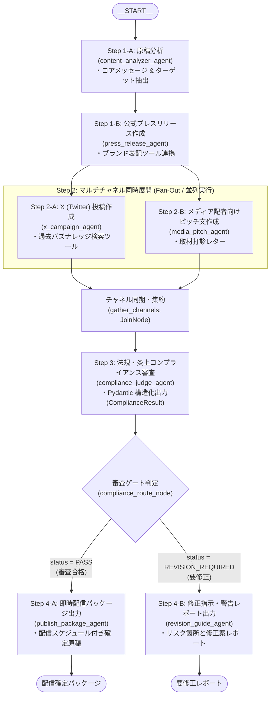

# ハッカソン: パターン1（業務設計重視の方向け）

パターン1は、**どのような自社業務が AI エージェント適用に向いているかを時間をとって検討したい**方向けのハッカソンパターンです。

実装（ソースコードの修正）は完了しなくても構いません。既存業務プロセスを可視化し、新業務（エージェントフローの設計）を完成させることに重点を置いてください。

以下のアイデア集などを参考にしてください。

## アイデア集

ADK 2.0 のマルチエージェントや `Workflow`（条件分岐、並列調査、集約、品質チェック）を活かせる業務ユースケースのアイデア例です。テーマ選定や企画の参考にしてください。

### 💼 営業・プリセールス
- **提案書・見積作成自動化**: 顧客の要望ヒアリング内容から要件抽出 ➔ 過去事例・技術仕様・価格表を並列検索 ➔ 提案書ドラフト生成 ➔ 利益率・規約チェック
- **商談事前リサーチ & 戦略立案**: 訪問先企業のIR・ニュース・業界動向を自動調査 ➔ 顧客の潜在課題とニーズを予測 ➔ 想定問答・トークスクリプト作成
- **失注・商談履歴分析**: SFA/CRMの商談ログを解析 ➔ 失注要因や競合動向をカテゴリ別に集約 ➔ 次回アプローチ施策を自動提案

### ⚖️ 法務・コンプライアンス・知財
- **契約書レビュー & リスク判定**: 契約条項の抽出 ➔ 自社法務基準・過去類似契約・関連法例を並列照会 ➔ リスク条項の指摘・修正案ドラフト作成
- **新規事業・新機能の法規制・ガイドライン審査**: サービス企画書の読み込み ➔ 個人情報保護法、景表法、業界ガイドラインとの適合性チェック ➔ 改善提言書作成
- **特許・商標侵害クリアランス**: アイデア・ネーミングの概要入力 ➔ 既存特許・商標DBの類似検索 ➔ 侵害リスク度判定と回避案提示

### 📣 マーケティング・広報・SNS
- **マルチチャネル向けコンテンツ同時展開**: プレスリリースや新着記事の要約 ➔ X, LinkedIn, note, メルマガ向けに最適なトーン＆マナーで並列生成 ➔ 炎上・ブランド毀損リスク判定
- **競合製品・市場トレンド調査レポート**: 各社Web・リリース情報の収集 ➔ 価格・機能・ターゲット層を多角的に比較分析 ➔ ポジショニングマップ・レポート生成
- **広告コピー・バナーテキスト大量生成**: ターゲット層別のペルソナ設定 ➔ 訴求軸（価格・スピード・品質等）ごとに複数案を並列生成 ➔ CTR予測・レギュレーション審査

### 🛠️ IT運用・情シス・セキュリティ
- **障害インシデント初動対応**: アラートログの解析 ➔ 過去障害ナレッジ・システム構成図・メトリクスを並列確認 ➔ 初動周知文の作成 & 復旧手順ドラフト
- **社内ITヘルプデスク & 権限申請自動化**: 従業員の質問・申請内容を判定 ➔ 社内規定チェック & 承認ルート特定 ➔ 申請チケット自動起票 & ユーザーへの初期案内
- **セキュリティ脆弱性（CVE）影響調査**: 新たに公開された脆弱性情報の取得 ➔ 社内システム・依存ライブラリ一覧との突合 ➔ 影響度評価 & パッチ適用優先度レポート作成

### 💻 ソフトウェア開発・エンジニアリング
- **Pull Request 自動レビュー & テスト生成**: コード差分の解析 ➔ セキュリティ・パフォーマンス・命名規則の並列検証 ➔ レビューコメント & ユニットテストコード作成
- **API仕様書・SDKドキュメント自動生成**: コード・スキーマ定義の読み込み ➔ 各エンドポイントの解説 & 多言語（Python/Go/TS等）サンプルコード作成 ➔ チュートリアル生成
- **レガシーコード解析・リファクタリング支援**: 古いコードの依存関係・処理フロー可視化 ➔ 最新言語仕様・フレームワークへの移行方針作成 ➔ 移行コードドラフト生成

### 👥 人事・採用・総務
- **中途採用レジュメスクリーニング & 面接質問生成**: 候補者レジュメのスキル抽出 ➔ 募集要項との適合度分析 ➔ 候補者に応じた深掘り面接設問リストの自動作成
- **社内規程・福利厚生・就業規則ナビゲーション**: 従業員の相談トリアージ ➔ 就業規則・育児介護規定・慶弔規定の横断検索 ➔ 申請手順の案内 & 必要書類ドラフト作成
- **新入社員オンボーディング支援**: 入社者の職種・部署に応じた研修カリキュラム提案 ➔ 必要な権限・PC初期設定手順のパーソナライズ案内 ➔ 定期フォローアップ面談の設問作成

### 💰 経理・財務・購買
- **経費精算・請求書突合 & 異常検知**: 請求書・領収書データ読み取り ➔ 購買申請・発注データ・社内規程と照合 ➔ 異常値・不正リスク検知 & 承認者向けサマリ作成
- **相見積もり比較 & 価格交渉支援**: 複数ベンダーの見積書を項目別に並列比較 ➔ 単価差分・仕様差分の可視化 ➔ コスト削減提案 & 価格交渉メール文作成
- **月次決算・業績差異分析レポート**: 財務諸表データの読み込み ➔ 予算実績差異・前年同期比の要因分析 ➔ 経営陣向け業績サマリ & コメントドラフト生成

### 🏭 業界特化型（製造・不動産・医療など）
- **製造現場の不具合・ヒヤリハット分析**: 現場日報やトラブル報告の解析 ➔ 過去トラブル事例・設備仕様書の照会 ➔ 原因仮説立案 & 再発防止策ドラフト作成
- **不動産物件提案 & エリアリサーチ**: 顧客の希望条件整理 ➔ 物件DB検索 & 周辺環境（学区・治安・ハザードマップ・利便性）の並列リサーチ ➔ 提案レター作成
- **医療・介護の申し送り・カルテ要約**: 日々のバイタル・看護記録の読み取り ➔ 申し送り事項・注意フラグの抽出 ➔ 次シフト向け引き継ぎサマリ作成

## カスタマイズ・拡張ガイド

### ワークフローグラフの変更・追加 (`agent.py`)
- **新しい専門エージェントの追加**: 例えば、Step 2 に「**競合比較エージェント**」や「**法務チェックエージェント**」を追加したい場合は、`LlmAgent` を定義し、`parallel_trigger` からのエッジと `gather_research` へのエッジを追加するだけで簡単に並列エージェントを増やせます。
- **新しい条件分岐の作成**: `route_decision_node` のように `FunctionNode` で `ctx.route` をセットし、`edges` に辞書 `{ "route_name": destination_node }` を指定します。

### プロンプトのカスタマイズ (`prompts/`)
- `prompts/` 配下の各ファイルを編集することで、指示内容、判定基準、出力フォーマットを即座に変更できます。
- `{triage_result?}`, `{knowledge_result?}` などのプレースホルダーにより、前段ノードの実行結果をセッションステートから参照可能です。

### ツールの追加・差し替え (`tools/`)
- `tools/` 配下の Python 関数を自由に変更・追加できます。
- 関数の docstring と型ヒントを記述して `LlmAgent(tools=[your_tool_func])` に渡すだけで、Gemini が自動的に Tool Calling を行います。
- 外部 REST API や BigQuery などの実データベースへの接続へも容易に差し替え可能です。

# ハッカソン: パターン2（実装技術重視の方向け）

パターン2は、**ADK 2.0 の実践的なマルチエージェント実装技術を身につけたい** 方向けのハンズオンコースです。

本コースでは、既存のカスタマーサポート業務コード（`customer_support`）を修正して、広報・マーケティング業務の **「新着リリース・記事からのマルチチャネル広報コンテンツ自動展開＆審査ゲートワークフロー」** へとソースコードをステップバイステップで書き換えていきます。

単なるプロンプトの差し替えだけでなく、**「直列パイプライン ➔ 中間Fan-Out（並列実行） ➔ Fan-In（同期集約） ➔ コンプライアンス審査 ➔ 末尾の審査ゲート（条件分岐）」** という、元のサンプルとは異なるワークフロー構造（`edges`）を自分の手で記述することで、ADK 2.0 のグラフオーケストレーション技術を体得できます。

---

## 1. 業務テーマと新ワークフロー設計

### 📣 業務課題: 広報・マーケティングのコンテンツ多面展開とコンプライアンス審査
企業が新製品や新機能、導入事例を発表する際、広報・マーケティング部門では以下のような業務が発生します:
1. **コアメッセージの整理**: 元の発表資料から訴求軸や対象ターゲットを整理する。
2. **公式プレスリリースの執筆**: ブランドトーンや公式表記ルールに準拠した正式な発表文を作成する。
3. **各チャネル向けのリライト**:
   - **X (旧 Twitter)**: フックになる冒頭文、140文字以内のスレッド、拡散ハッシュタグ。
   - **メディア記者向けピッチ**: 記者クラブや専門メディアへの個別取材打診文。
4. **法規・炎上コンプライアンス審査**:
   - 誇大広告（景品表示法の優良誤認）、他社比較の根拠、著作権、ブランド毀損リスクを厳格にチェック。
   - 審査結果が **「合格」** であれば即座に配信スケジュール付きパッケージを出力し、**「要修正」** であればリスク箇所の指摘と修正指示書を出力する。

---

### 🔄 元のサンプル vs 新ワークフローの構造比較

受講者が書き換える新ワークフローは、元のサンプルコード（`customer_support`）と異なるトポロジー（グラフの接続形状）を持っています。

| 比較項目 | 元のサンプル (`customer_support`) | パターン2（広報・マーケティング新フロー） |
| :--- | :--- | :--- |
| **グラフ全体の形状** | **冒頭で条件分岐** ➔ 並列 ➔ 合流 ➔ 1本道 | **直列で土台作成** ➔ **中間で並列展開** ➔ **末尾で合否判定分岐** |
| **開始パイプライン** | START ➔ トリアージ ➔ ルート判定 | START ➔ 原稿分析 ➔ **公式プレスリリース作成**（直列） |
| **並列展開 (Fan-Out)** | 冒頭の分岐直後に3並列 | プレスリリース完成後に2並列（**X投稿** / **記者向けピッチ**） |
| **条件分岐の配置** | ワークフローの **最初**（簡易か詳細か） | ワークフローの **最後**（コンプライアンス審査ゲート） |
| **分岐先のアクション** | 簡易返信（1エージェントで終了） | **合格: 配信確定パッケージ** vs **要修正: 修正アドバイスレポート** |

---

### 🏗️ ワークフローグラフ (Mermaid)



---

## 2. ソースコード書き換え手順

本コースでは、新業務（広報・マーケティング新フロー）の各機能に合わせて、**各ファイルの名前もわかりやすい適切な名前に変更（リネーム）** していきます。  
（※ `adk web` やデプロイコマンドをそのまま利用できるよう、一番外側のパッケージフォルダ名 `customer_support_XX/` のみそのまま維持します）

```
customer_support_XX/
├── tools/
│   ├── buzz_tool.py          <-- 【リネーム】knowledge_tool.py から変更（過去バズ・ハッシュタグ検索）
│   ├── brand_tool.py         <-- 【リネーム】customer_tool.py から変更（自社ブランド表記ルール照会）
│   └── __init__.py           <-- 【要修正】新ファイル名から import するよう書き換え！
├── prompts/
│   ├── analyzer.py           <-- 【リネーム】triage.py から変更（原稿分析プロンプト）
│   ├── press_release.py      <-- 【リネーム】customer.py から変更（公式リリースプロンプト）
│   ├── x_campaign.py         <-- 【リネーム】knowledge.py から変更（X投稿作成プロンプト）
│   ├── media_pitch.py        <-- 【リネーム】quick.py から変更（記者ピッチ作成プロンプト）
│   ├── compliance.py         <-- 【リネーム】risk.py から変更（コンプライアンス審査プロンプト）
│   ├── publish_package.py    <-- 【リネーム】draft.py から変更（即時配信パッケージプロンプト）
│   ├── revision_guide.py     <-- 【リネーム】quality.py から変更（修正指示レポートプロンプト）
│   └── __init__.py           <-- 【要修正】新ファイル名から import するよう書き換え！
├── agent.py                  <-- 【要修正】新エージェント定義 & 新ワークフロー edges の構築！
└── __init__.py               <-- 【要修正】パッケージ全体のエクスポート定義を整理
```

---

### 💡 なぜファイル名を変えるとコードの書き換えが必要なのか？（仕組みの理解）

受講者がつまずきやすい重要なポイントとして、**「ファイル名を変更した際、ソースコードのどの部分を修正しなければいけないのか」** という Python のモジュール依存関係の仕組みがあります。

#### 1. Python の `import` とファイル名の関係
Python では、`from .buzz_tool import search_buzz_templates` のように記述したとき、ドットに続く **`buzz_tool` という名前はそのまま `buzz_tool.py` というファイル名（拡張子 `.py` を除いた部分）** を探しに行きます。  
もしファイル名を `buzz_tool.py` に変更したのにコード側の `from .knowledge_tool ...` を放置していると、Python は古いファイルを探そうとして **`ModuleNotFoundError: No module named '...knowledge_tool'`** というエラーで停止してしまいます。

#### 2. `__init__.py` の役割（パッケージの受付窓口）
`tools/` や `prompts/` のフォルダ内にある `__init__.py` は、フォルダ全体を 1 つの「パッケージ」としてまとめるための受付窓口（ファサード）です。
- 各ファイル（`brand_tool.py`, `buzz_tool.py` など）で作った関数やプロンプトを、`__init__.py` で一度 `import` して `__all__` に登録（エクスポート）します。
- これにより、`agent.py` からは `from .tools import get_brand_guidelines, search_buzz_templates` や `from .prompts import ANALYZER_INSTRUCTION, ...` のように、**個別のファイル名を意識せずパッケージ名からまとめてシンプルにインポート** できます。
- **つまり、「内部のファイル名を変更したら、そのファイルをインポートしている `__init__.py` の import 元を必ず新しいファイル名に書き換える」** という連動ルールが存在します。

#### 🔄 ファイル名変更と影響範囲の一覧表

| フォルダ | 変更前のファイル名 | 変更後のファイル名 | 主な定義内容 | 影響を受けるソースコード箇所 |
| :--- | :--- | :--- | :--- | :--- |
| `tools/` | `knowledge_tool.py` | **`buzz_tool.py`** | `search_buzz_templates` 関数 | `tools/__init__.py` (`from .buzz_tool import ...`) |
| `tools/` | `customer_tool.py` | **`brand_tool.py`** | `get_brand_guidelines` 関数 | `tools/__init__.py` (`from .brand_tool import ...`) |
| `prompts/` | `triage.py` | **`analyzer.py`** | `ANALYZER_INSTRUCTION` | `prompts/__init__.py` (`from .analyzer import ...`) |
| `prompts/` | `customer.py` | **`press_release.py`** | `PRESS_RELEASE_INSTRUCTION` | `prompts/__init__.py` (`from .press_release import ...`) |
| `prompts/` | `knowledge.py` | **`x_campaign.py`** | `X_CAMPAIGN_INSTRUCTION` | `prompts/__init__.py` (`from .x_campaign import ...`) |
| `prompts/` | `quick.py` | **`media_pitch.py`** | `MEDIA_PITCH_INSTRUCTION` | `prompts/__init__.py` (`from .media_pitch import ...`) |
| `prompts/` | `risk.py` | **`compliance.py`** | `COMPLIANCE_INSTRUCTION`, `ComplianceResult` | `prompts/__init__.py` (`from .compliance import ...`) |
| `prompts/` | `draft.py` | **`publish_package.py`** | `PUBLISH_PACKAGE_INSTRUCTION` | `prompts/__init__.py` (`from .publish_package import ...`) |
| `prompts/` | `quality.py` | **`revision_guide.py`** | `REVISION_GUIDE_INSTRUCTION` | `prompts/__init__.py` (`from .revision_guide import ...`) |
| `(root)` | `__init__.py` | （維持） | パッケージエクスポート | `customer_support_XX/__init__.py` (旧コード依存の整理) |

---

### Step 1: ツールのリネームと書き換え (`tools/`)

まずはエージェントが呼び出す Python ツールを広報・マーケティング業務向けに変更します。

#### シェル変数の設定
ハンズオン時に設定したフォルダ名がシェル変数に設定されていることを確認します。

```bash
# 同じシェルセッションなら再設定の必要はありませんが、念のため再設定
AGENT_NAME="customer_support_XX"

# 正しく変数の内容が表示されていますか？書き換え忘れていませんか？
echo ${AGENT_NAME}
```

#### ファイル名のリネーム（名前の変更）
Cloud Shell / VS Code のエクスプローラーからファイルを右クリックして「名前の変更（Rename）」を行うか、ターミナルで以下のコマンドを実行してファイル名を変更します:

```bash
cd ${AGENT_NAME}/tools
mv knowledge_tool.py buzz_tool.py
mv customer_tool.py brand_tool.py
cd ../..
```

---

#### 1-1. `customer_support_XX/tools/buzz_tool.py` の実装（旧 `knowledge_tool.py`）
過去に SNS でエンゲージメントが高かった投稿パターンや推奨ハッシュタグを検索するツール `search_buzz_templates` に書き換えます。

```python
"""過去の広報バズ投稿・推奨ハッシュタグ検索ツール"""

from typing import Dict, List

# モック用の広報・SNS ナレッジデータ
BUZZ_DATABASE: List[Dict[str, str]] = [
    {
        "theme": "新機能・アップデート",
        "format": "【朗報 / ついに公開】＋ 課題提示 ＋ 解決策 ＋ 箇条書き3点 ＋ サービスURL",
        "hashtags": "#プロダクトアップデート #新機能リリース #業務効率化",
        "tips": "数字（作業時間〇%削減など）を1行目に明記し、改行を多めに入れて読みやすくする。",
    },
    {
        "theme": "導入事例・実績",
        "format": "【導入事例】＋ 企業名 ＋ 抱えていた課題 ＋ 劇的な導入成果 ＋ インタビュー記事URL",
        "hashtags": "#導入事例 #カスタマーストーリー #DX事例",
        "tips": "顧客の生の声を引用符（「」）で括り、具体的な成果数値を強調する。",
    },
    {
        "theme": "イベント・セミナー",
        "format": "【無料ウェビナー開催】＋ 登壇テーマ ＋ こんな方におすすめ ＋ 開催日時 ＋ 申込URL",
        "hashtags": "#ウェビナー #オンラインセミナー #イベント情報",
        "tips": "「先着〇名」「〇月〇日(木) 19:00〜」など限定感と日時を冒頭で明示する。",
    },
    {
        "theme": "AI・テクノロジー",
        "format": "【最新技術解説】＋ 業界のトレンド課題 ＋ 自社技術の強み ＋ 開発者コメント ＋ 技術ブログURL",
        "hashtags": "#生成AI #ADK #AIエージェント #技術ブログ",
        "tips": "エンジニアが共感する具体的な技術キーワードやアーキテクチャの要点を盛り込む。",
    },
]


def search_buzz_templates(theme: str) -> str:
    """投稿テーマに関連する過去のSNS高エンゲージメント事例・推奨フォーマットおよびハッシュタグを検索します。

    Args:
        theme: 投稿テーマやキーワード（例: "新機能", "アップデート", "導入事例", "イベント", "AI"）

    Returns:
        検索結果の推奨フォーマットとハッシュタグ一覧（Markdown形式）
    """
    theme_lower = theme.lower()
    matched = []
    for item in BUZZ_DATABASE:
        if (
            item["theme"].lower() in theme_lower
            or theme_lower in item["theme"].lower()
            or any(kw in theme_lower for kw in item["hashtags"].lower().split())
        ):
            matched.append(item)

    if not matched:
        matched = [BUZZ_DATABASE[0]]  # 該当なしの場合は汎用新機能テンプレート

    results = ["【SNS推奨投稿テンプレート・ナレッジ】"]
    for item in matched:
        results.append(
            f"■ テーマ: {item['theme']}\n"
            f"- 推奨フォーマット: {item['format']}\n"
            f"- 推奨ハッシュタグ: {item['hashtags']}\n"
            f"- 作成Tips: {item['tips']}\n"
        )
    return "\n".join(results)
```

---

#### 1-2. `customer_support_XX/tools/brand_tool.py` の実装（旧 `customer_tool.py`）
自社のブランド表記規程や公式メッセージルールを取得するツール `get_brand_guidelines` に書き換えます。

```python
"""自社ブランド表記ルール・ガイドライン照会ツール"""

from typing import Dict

BRAND_GUIDELINES: Dict[str, Dict[str, str]] = {
    "公式表記ルール": {
        "service_name": "Antigravity Agent Platform（※ Antigravity または AGY と略記可）",
        "prohibited_words": "「完全自動化」「絶対に失敗しない」「業界最強」（根拠のない最上級表現は禁止）",
        "tone_and_manner": "親しみやすく、かつプロフェッショナルで信頼感のあるトーン。過度な煽り表現は避ける。",
    },
    "プレスリリース規定": {
        "title_rule": "30〜45文字以内。主語と提供価値（ユーザーメリット）を冒頭に置く。",
        "must_include": "1. 発表の背景、2. サービス概要と主要機能、3. 導入効果、4. 今後の展開、5. 問い合わせ先",
        "quote_format": "代表または開発責任者のコメントを必ず1箇所挿入すること。",
    },
    "メディアピッチ規定": {
        "lead_sentence": "記者が多忙であることを考慮し、メールの最初の3行で「なぜ今この記事を貴社で取り上げるべきか」を明記。",
        "target_media": "ITビジネスメディア、エンタープライズDX情報誌、テック系ポータルサイト",
    },
}


def get_brand_guidelines(category: str = "公式表記ルール") -> str:
    """公式プレスリリースやメディア向け原稿作成時に準拠すべきブランドガイドライン・表記ルールを取得します。

    Args:
        category: 照会するカテゴリ（"公式表記ルール", "プレスリリース規定", "メディアピッチ規定"）

    Returns:
        該当カテゴリのガイドライン・表記ルール規定テキスト
    """
    cleaned = category.strip()
    matched = None
    for key, value in BRAND_GUIDELINES.items():
        if cleaned in key or key in cleaned:
            matched = (key, value)
            break

    if not matched:
        matched = ("公式表記ルール", BRAND_GUIDELINES["公式表記ルール"])

    name, data = matched
    lines = [f"【自社ブランド・広報ガイドライン ({name})】"]
    for k, v in data.items():
        lines.append(f"- {k}: {v}")
    return "\n".join(lines)
```

---

#### 1-3. `customer_support_XX/tools/__init__.py` の修正（★重要: リネームに伴う import 元の変更）

> [!IMPORTANT]
> **なぜここを書き換えるのか？**  
> ファイル名を `knowledge_tool.py` ➔ `buzz_tool.py`、`customer_tool.py` ➔ `brand_tool.py` に変更したため、`tools/__init__.py` 内の import 文をそれぞれ新しいファイル名（`.brand_tool`, `.buzz_tool`）に合わせて修正する必要があります。  
> ここを修正することで、後ほど `agent.py` から `from .tools import get_brand_guidelines, search_buzz_templates` として読み込めるようになります。

```python
"""広報・マーケティング向けツールパッケージ"""

# 変更したファイル名 (.brand_tool, .buzz_tool) からインポートします
from .brand_tool import get_brand_guidelines
from .buzz_tool import search_buzz_templates

__all__ = [
    "search_buzz_templates",
    "get_brand_guidelines",
]
```

---

### Step 2: プロンプトファイルのリネームと書き換え (`prompts/`)

各エージェントのプロンプトファイルを広報・マーケティング業務に合わせてリネームし、内容を記述します。

#### 📁 ファイル名のリネーム（名前の変更）
Cloud Shell / VS Code のエクスプローラーから各ファイルの名前を変更（Rename）するか、ターミナルで以下のコマンドを実行して一括変更します:

```bash
cd ${AGENT_NAME}/prompts
mv triage.py analyzer.py
mv customer.py press_release.py
mv knowledge.py x_campaign.py
mv quick.py media_pitch.py
mv risk.py compliance.py
mv draft.py publish_package.py
mv quality.py revision_guide.py
cd ../..
```

---

#### 2-1. `customer_support_XX/prompts/analyzer.py` の実装（旧 `triage.py`）
入力されたアナウンス原稿から、コアメッセージ・主要ターゲット・訴求ポイントを抽出するプロンプトです。

```python
"""Step 1-A: 原稿分析エージェントのプロンプト定義"""

ANALYZER_INSTRUCTION = """あなたは企業の広報・マーケティング部門に所属する「コンテンツ分析専門エージェント」です。
ユーザーから入力された発表原稿・メモを分析し、広報展開に必要なコア要素を抽出してください。

【あなたの役割】
1. 発表の主旨・コアメッセージ（何を伝えたいのか）を特定する。
2. 対象となる主要ターゲット（例: エンジニア、IT経営層、一般ユーザー等）を定義する。
3. ユーザーメリット・独自性（競合との差別化ポイント、定量的成果など）を整理する。

【出力フォーマット】
以下の構成で簡潔に整理して出力してください。その他の要素は記載不要です:
========================================
【原稿分析サマリ】
- 発表タイトル案: <簡潔で魅力的なタイトル>
- 対象ターゲット: <ペルソナ>
- コアメッセージ: <1〜2行で要約>
- 3大訴求ポイント:
  1. <訴求点1>
  2. <訴求点2>
  3. <訴求点3>
========================================
"""
```

---

#### 2-2. `customer_support_XX/prompts/press_release.py` の実装（旧 `customer.py`）
分析結果をもとに、ブランド表記ガイドラインに準拠した正式なプレスリリース草案を作成します。

```python
"""Step 1-B: 公式プレスリリース作成エージェントのプロンプト定義"""

PRESS_RELEASE_INSTRUCTION = """あなたは経験豊富な「プレスリリース作成専門エージェント」です。
前段の原稿分析結果に基づき、メディアや公式Webサイトに掲載する正式なプレスリリース草案を作成してください。

【重要指示】
必ず `get_brand_guidelines` ツールを実行し、「プレスリリース規定」および「公式表記ルール」を確認した上で作成してください。

【入力データ（原稿分析結果）】
{analysis_result?}

【プレスリリースの構成】
1. タイトル（30〜45文字以内、提供価値を明記）
2. リード文（誰が、何を、なぜ発表するのかを簡潔に）
3. 開発背景・社会的課題
4. 本サービス/新機能の特長・詳細（箇条書き）
5. 責任者からのコメント
6. 今後の展望・ロードマップ
"""
```

---

#### 2-3. `customer_support_XX/prompts/x_campaign.py` の実装（旧 `knowledge.py`）
公式プレスリリースをもとに、SNS で拡散されるフックの効いた X(Twitter) スレッド投稿案を作成します。

```python
"""Step 2-A: X (Twitter) 投稿作成エージェントのプロンプト定義"""

X_CAMPAIGN_INSTRUCTION = """あなたはSNSマーケティングのプロである「X(Twitter)投稿専門エージェント」です。
完成した公式プレスリリース草案をもとに、X 上で最もインプレッションとエンゲージメントを獲得できる投稿案を作成してください。

【重要指示】
必ず `search_buzz_templates` ツールを実行し、テーマに合致した推奨フォーマットとハッシュタグを参照してください。

【入力データ（公式プレスリリース草案）】
{press_release_result?}

【作成要件】
- 1投稿目（メインポスト）: 140文字以内。読者の興味を惹くフック、重要な数字、改行の工夫、ハッシュタグを含める。
- 2投稿目（スレッドツリー用）: 詳細な特長3点と公式リリースへの誘導リンク。
"""
```

---

#### 2-4. `customer_support_XX/prompts/media_pitch.py` の実装（旧 `quick.py`）
新聞・Webメディア記者に向けた個別の取材依頼ピッチレターを作成します。

```python
"""Step 2-B: メディア記者向け取材ピッチ文作成エージェントのプロンプト定義"""

MEDIA_PITCH_INSTRUCTION = """あなたはメディアリレーションズのスペシャリストである「記者ピッチ専門エージェント」です。
完成した公式プレスリリース草案をもとに、IT・ビジネス系メディアの記者に向けた「個別取材打診メール（ピッチレター）」を作成してください。

【入力データ（公式プレスリリース草案）】
{press_release_result?}

【作成要件】
多忙な記者が最初の3行で「なぜ今、この記事を自社媒体で報じるべきか」を理解できるよう工夫してください:
1. 件名: 記者が開封したくなる具体的でニュース価値のある件名
2. 導入: 「貴媒体の読者にとってなぜ重要か」を端的に説明
3. ニュースの要点: 箇条書きで3点
4. 取材対応の案内: 「開発責任者への個別インタビュー」「デモ画面の先行提供」などのオファー
"""
```

---

#### 2-5. `customer_support_XX/prompts/compliance.py` の実装（旧 `risk.py`）
各チャネルの原稿を総合審査し、合否判定を下すエージェントです。**Pydantic による構造化出力 (`ComplianceResult`)** を定義します。

```python
"""Step 3: 法規・炎上コンプライアンス審査エージェントのプロンプト & 構造化出力スキーマ"""

from typing import List, Literal
from pydantic import BaseModel, Field


class ComplianceResult(BaseModel):
    """コンプライアンス審査エージェントの構造化出力スキーマ。

    合否ステータス（PASS / REVISION_REQUIRED）、リスクスコア、指摘事項を定義します。
    """

    status: Literal["PASS", "REVISION_REQUIRED"] = Field(
        ...,
        description="総合審査結果。重大な誇大広告や炎上リスクがなければ 'PASS'、修正が必要な場合は 'REVISION_REQUIRED'",
    )
    risk_score: int = Field(
        ...,
        description="リスク評価スコア（0: リスクなし 〜 100: 極めて危険）。50点以上は REVISION_REQUIRED",
    )
    risk_factors: List[str] = Field(
        default_factory=list,
        description="検出されたリスク項目（例: '根拠のない最上級表現「完全自動」'、'他社比較の根拠不足' 等）",
    )
    summary: str = Field(
        ...,
        description="審査コメントおよび判定理由の簡潔な要約",
    )


COMPLIANCE_INSTRUCTION = """あなたは企業の法務・コンプライアンスおよびブランドリスクの「審査専門エージェント」です。
生成された以下の「プレスリリース」「X投稿」「記者ピッチ」の全原稿を精査し、法的問題やブランド毀損リスクを判定してください。

【審査対象の原稿】
■ 公式プレスリリース:
{press_release_result?}

■ X (Twitter) 投稿:
{x_result?}

■ メディア記者向けピッチ:
{pitch_result?}

【審査基準】
1. 景品表示法・薬機法: 「完全自動」「絶対に失敗しない」「業界最強」などの誇大・優良誤認表現がないか。
2. 他社権利・商標: 他社サービスを根拠なく批判または商標権を侵害していないか。
3. ソーシャル炎上リスク: 差別的・不誠実・誤解を招くトーンがないか。

リスクスコアが 50 未満かつ重大な違反がなければ status を "PASS" と判定してください。
根拠のない最上級表現や炎上リスクがある場合は、必ず "REVISION_REQUIRED" と判定してください。
"""
```

---

#### 2-6. `customer_support_XX/prompts/publish_package.py` の実装（旧 `draft.py`）
審査合格時に、全チャネルの原稿と配信スケジュールをまとめた確定セットを出力します。

```python
"""Step 4-A: 即時配信確定パッケージ作成エージェントのプロンプト定義"""

PUBLISH_PACKAGE_INSTRUCTION = """あなたは「広報配信マネジメントエージェント」です。
コンプライアンス審査を無事クリアした全コンテンツを統合し、チームがすぐに配信・投稿できる【確定版配信パッケージ】を生成してください。

【各チャネルの完成原稿】
■ 公式プレスリリース:
{press_release_result?}

■ X (Twitter) 投稿案:
{x_result?}

■ メディア記者向けピッチ文:
{pitch_result?}

■ 審査クリアサマリ:
{compliance_result?}

【出力構成】
1. 🎉【コンプライアンス審査合格】配信確定サマリ
2. 📅 推奨配信スケジュール（プレスリリース公開、SNS投稿、記者メール送信の最適タイミング）
3. 📝 各チャネルの確定原稿（コピーしてそのまま使える完全版）
"""
```

---

#### 2-7. `customer_support_XX/prompts/revision_guide.py` の実装（旧 `quality.py`）
審査不合格時に、リスク箇所の具体的な指摘とリライト改善案をまとめたレポートを出力します。

```python
"""Step 4-B: 修正指示・警告レポート作成エージェントのプロンプト定義"""

REVISION_GUIDE_INSTRUCTION = """あなたは「広報リスクアドバイザリーエージェント」です。
コンプライアンス審査で問題が検知されたため、広報・マーケティングチームに向けた【修正指示・警告レポート】を作成してください。

【審査結果詳細】
{compliance_result?}

【作成された原稿】
- プレスリリース: {press_release_result?}
- X 投稿: {x_result?}

【レポート構成】
1. ⚠️【要修正】コンプライアンス警告サマリ（リスクスコアと検出された懸念事項）
2. 🔍 具体的な指摘箇所（どの文言がなぜNGなのか）
3. 💡 推奨リライト修正案（NG表現をどう言い換えるべきかの具体例）
"""
```

---

#### 2-8. `customer_support_XX/prompts/__init__.py` の修正（★重要: リネームに伴う import 元の変更）

> [!IMPORTANT]
> **なぜここを書き換えるのか？**  
> 7つのプロンプトファイルをすべて新しいファイル名にリネームしたため、`prompts/__init__.py` 内の `from .xxx import ...` のモジュール名（`.xxx` の部分）をすべてリネーム後の名前に更新する必要があります。  
> これを忘れると、`agent.py` が起動時に `from .prompts import ...` を実行した際、`ModuleNotFoundError: No module named 'customer_support_XX.prompts.customer'` などのエラーが発生します。

```python
"""プロンプト定義モジュールの一括エクスポート"""

# リネームした各ファイル名 (.analyzer, .press_release, ...) からインポートします
from .analyzer import ANALYZER_INSTRUCTION
from .compliance import COMPLIANCE_INSTRUCTION, ComplianceResult
from .media_pitch import MEDIA_PITCH_INSTRUCTION
from .press_release import PRESS_RELEASE_INSTRUCTION
from .publish_package import PUBLISH_PACKAGE_INSTRUCTION
from .revision_guide import REVISION_GUIDE_INSTRUCTION
from .x_campaign import X_CAMPAIGN_INSTRUCTION

__all__ = [
    "ANALYZER_INSTRUCTION",
    "PRESS_RELEASE_INSTRUCTION",
    "X_CAMPAIGN_INSTRUCTION",
    "MEDIA_PITCH_INSTRUCTION",
    "COMPLIANCE_INSTRUCTION",
    "ComplianceResult",
    "PUBLISH_PACKAGE_INSTRUCTION",
    "REVISION_GUIDE_INSTRUCTION",
]
```

---

### Step 3: ワークフロー定義の書き換えとパッケージ整理

ここが本パターンの最大の学習ポイントです！  
`customer_support_XX/agent.py` で新しいワークフローを構築し、パッケージ全体の窓口となる `customer_support_XX/__init__.py` を整理します。

---

#### 3-1. `customer_support_XX/agent.py` の修正（新エージェント定義 & ワークフロー構築）

> [!TIP]
> **💡 なぜファイル名を変えたのに `agent.py` からは `.prompts` や `.tools` と書けるのか？**  
> `agent.py` の冒頭では、以下のように `prompts` や `tools` フォルダから直接インポートを行っています：
> ```python
> from .prompts import ANALYZER_INSTRUCTION, ...
> from .tools import get_brand_guidelines, search_buzz_templates
> ```
> これは、Step 1-3 と Step 2-8 で各フォルダの `__init__.py` を正しく書き換えたためです。`__init__.py` が各ファイル（`analyzer.py` や `buzz_tool.py` 等）を読み込んでまとめて外部へ公開してくれているおかげで、`agent.py` 側は個別ファイルの詳細パスを意識することなく、フォルダ名（パッケージ名）からクリーンに取り込むことができます。

`customer_support_XX/agent.py` を開き、以下の内容に書き換えます:

```python
"""広報・マーケティング向けマルチチャネル自動展開＆審査ゲートワークフロー

【ワークフロー構造】
1. 直列パイプライン (Sequential):
   START -> content_analyzer_agent -> press_release_agent (公式リリース草案作成)
2. 中間 Fan-Out (並列展開):
   press_release_agent から 2 つの派生チャネルへ同時分岐
   - x_campaign_agent (X投稿・バズ施策)
   - media_pitch_agent (メディア記者向けピッチ文)
3. Fan-In (同期・集約) & 審査:
   2つの完了を gather_channels (JoinNode) で集約 -> compliance_judge_agent (法規・炎上審査)
4. 末尾の審査ゲート (Routing / 条件分岐):
   compliance_route_node -> {
       "approved": publish_package_agent (配信確定パッケージ),
       "revision_needed": revision_guide_agent (修正指示レポート)
   }
"""

import os
from typing import Any
from dotenv import load_dotenv
from google.adk.agents import LlmAgent
from google.adk.agents.context import Context
from google.adk.models import Gemini
from google.adk.workflow import FunctionNode, JoinNode, START, Workflow

from .prompts import (
    ANALYZER_INSTRUCTION,
    COMPLIANCE_INSTRUCTION,
    ComplianceResult,
    MEDIA_PITCH_INSTRUCTION,
    PRESS_RELEASE_INSTRUCTION,
    PUBLISH_PACKAGE_INSTRUCTION,
    REVISION_GUIDE_INSTRUCTION,
    X_CAMPAIGN_INSTRUCTION,
)
from .tools import get_brand_guidelines, search_buzz_templates

# 環境変数の読み込み
load_dotenv(override=True)
if os.getenv("GOOGLE_GENAI_USE_VERTEXAI") is None and os.getenv("GOOGLE_GENAI_USE_ENTERPRISE") is None:
    os.environ["GOOGLE_GENAI_USE_VERTEXAI"] = "1"

MODEL_NAME = os.getenv("GEMINI_MODEL", "gemini-3.8-flash")
MODEL_LOCATION = os.getenv("GEMINI_LOCATION", "global")

gemini_model = Gemini(
    model=MODEL_NAME,
    client_kwargs={"location": MODEL_LOCATION},
)

# ==============================================================================
# 1. 各専門エージェントの定義 (LlmAgent)
# ==============================================================================

# Step 1-A: 原稿分析エージェント
content_analyzer_agent = LlmAgent(
    name="content_analyzer_agent",
    model=gemini_model,
    instruction=ANALYZER_INSTRUCTION,
    output_key="analysis_result",
    description="入力された発表原稿からコアメッセージとターゲット層を抽出するエージェント",
)

# Step 1-B: 公式プレスリリース作成エージェント（ツール: get_brand_guidelines）
press_release_agent = LlmAgent(
    name="press_release_agent",
    model=gemini_model,
    instruction=PRESS_RELEASE_INSTRUCTION,
    tools=[get_brand_guidelines],
    output_key="press_release_result",
    description="ブランド表記ガイドラインに準拠した公式プレスリリース草案を作成するエージェント",
)

# Step 2-A: X(Twitter) 投稿作成エージェント（ツール: search_buzz_templates）
x_campaign_agent = LlmAgent(
    name="x_campaign_agent",
    model=gemini_model,
    instruction=X_CAMPAIGN_INSTRUCTION,
    tools=[search_buzz_templates],
    output_key="x_result",
    description="過去の高エンゲージメントナレッジを参照し魅力的なXスレッド投稿を作成するエージェント",
)

# Step 2-B: メディア記者向け取材ピッチ文作成エージェント
media_pitch_agent = LlmAgent(
    name="media_pitch_agent",
    model=gemini_model,
    instruction=MEDIA_PITCH_INSTRUCTION,
    output_key="pitch_result",
    description="記者クラブやメディア関係者への個別取材打診レターを作成するエージェント",
)

# Step 3: 法規・炎上コンプライアンス審査エージェント（Pydantic 構造化出力）
compliance_judge_agent = LlmAgent(
    name="compliance_judge_agent",
    model=gemini_model,
    instruction=COMPLIANCE_INSTRUCTION,
    output_schema=ComplianceResult,
    output_key="compliance_result",
    description="景表法、誇大広告、炎上リスクをスコアリングし合否を判定する審査エージェント",
)

# Step 4-A: 即時配信パッケージ作成エージェント（合格ルート）
publish_package_agent = LlmAgent(
    name="publish_package_agent",
    model=gemini_model,
    instruction=PUBLISH_PACKAGE_INSTRUCTION,
    output_key="final_result",
    description="審査をクリアした各チャネルの原稿を統合し配信スケジュール付きパッケージを出力するエージェント",
)

# Step 4-B: 修正指示・警告レポート作成エージェント（要修正ルート）
revision_guide_agent = LlmAgent(
    name="revision_guide_agent",
    model=gemini_model,
    instruction=REVISION_GUIDE_INSTRUCTION,
    output_key="final_result",
    description="コンプライアンス警告と具体的なリライトアドバイスを出力するエージェント",
)

# ==============================================================================
# 2. 制御ノードの定義 (FunctionNode / JoinNode)
# ==============================================================================

# 中間並列処理の同期・集約ノード (Fan-In)
gather_channels = JoinNode(
    name="gather_channels",
)


def decide_compliance_route(ctx: Context, node_input: Any = None) -> str:
    """コンプライアンス審査結果（ComplianceResult）に基づいて後続ルートを分岐します。

    - status が 'PASS' の場合: approved（配信確定パッケージへ）
    - status が 'REVISION_REQUIRED' の場合: revision_needed（修正指示レポートへ）
    """
    comp_raw = ctx.state.get("compliance_result") or node_input
    status = "REVISION_REQUIRED"

    if isinstance(comp_raw, ComplianceResult):
        status = comp_raw.status
    elif isinstance(comp_raw, dict):
        status = comp_raw.get("status", "REVISION_REQUIRED")
    elif isinstance(comp_raw, str):
        try:
            parsed = ComplianceResult.model_validate_json(comp_raw)
            status = parsed.status
        except Exception:
            if "PASS" in comp_raw:
                status = "PASS"

    if status == "PASS":
        ctx.route = "approved"
    else:
        ctx.route = "revision_needed"

    return f"Compliance Route Selected: {ctx.route}"


# 末尾の審査ゲート判定ノード
compliance_route_node = FunctionNode(
    name="compliance_route_node",
    func=decide_compliance_route,
)

# ==============================================================================
# 3. ADK 2.0 ワークフロー定義 (Workflow & Edges) ★ここが重要
# ==============================================================================

root_agent = Workflow(
    name="marketing_pr_workflow",
    description="広報・マーケティング向けマルチチャネル自動展開＆審査ゲートワークフロー",
    edges=[
        # --- 1. 直列パイプライン (Sequential) ---
        # 開始 -> 原稿分析 -> 公式プレスリリース草案作成
        (START, content_analyzer_agent, press_release_agent),

        # --- 2. 中間 Fan-Out（並列展開） ---
        # プレスリリース完成後、2つの派生メディアへ同時に分岐
        (press_release_agent, x_campaign_agent, gather_channels),
        (press_release_agent, media_pitch_agent, gather_channels),

        # --- 3. Fan-In（集約） & コンプライアンス審査 ---
        # 2つの原稿が揃ったら gather_channels から審査エージェント -> 審査ゲートノードへ
        (gather_channels, compliance_judge_agent, compliance_route_node),

        # --- 4. 末尾の審査ゲート判定（Routing / 条件分岐） ---
        # 審査結果に応じてアウトプットを完全に分岐
        (
            compliance_route_node,
            {
                "approved": publish_package_agent,      # 合格時: 配信パッケージ生成
                "revision_needed": revision_guide_agent, # 要修正時: 修正指示レポート生成
            },
        ),
    ],
)

# エイリアス
workflow = root_agent
```

---

#### 3-2. `customer_support_XX/__init__.py` の修正（★重要: ルートエクスポートの整理）

> [!WARNING]
> **なぜここを書き換えるのか？**  
> 元のサンプルの `customer_support_XX/__init__.py` には、古いカスタマーサポート用のエージェント（`triage_agent`, `draft_creation_agent` など）や `from .prompts import TriageResult` が記述されていました。  
> ここを修正しないままにしておくと、`adk web` や外部スクリプトからパッケージとして読み込む際に **`ImportError: cannot import name 'TriageResult' from 'customer_support_XX.prompts'`** というエラーが発生します。  
> そのため、ルートの `__init__.py` を以下のように `root_agent` と `workflow` のみをエクスポートするシンプルな内容に書き換えておきましょう。

```python
"""広報・マーケティング向けマルチチャネル自動展開＆審査ゲートワークフロー パッケージ"""

from .agent import root_agent, workflow

__all__ = [
    "root_agent",
    "workflow",
]
```

---

### Step 4: Web UI (`adk web`) での動作確認

コードの書き換えが完了したら、Web UI で動作確認を行いましょう。

#### 1. サーバーの起動
Cloud Shell ターミナルで以下のコマンドを実行します:
```bash
adk web --port 8080 --allow_origins="regex:.*"
```
Cloud Shell 右上の「**ウェブでプレビュー**」から「**ポート 8080 でプレビュー**」を開きます。

---

#### 🧪 テストシナリオ: 正常系（審査合格ルート ➔ 即時配信パッケージ）

チャット欄に、適切な表現の新機能発表原稿を入力して送信します:

```text
【新製品発表メモ】
サービス名: Antigravity Agent Platform
概要: 企業の複雑な業務プロセスを、複数のAIエージェントが協調して自律実行するマルチエージェント開発基盤を本日より一般提供開始します。
特長:
1. 直感的なグラフベースでのワークフロー構築
2. ツール連携（Tool Calling）の自動最適化
3. 開発運用コストを従来の約40%削減可能（自社PoC実績値）
対象: 大手エンタープライズのDX推進部門、SaaS開発エンジニア
```

**🔍 観察ポイント:**
1. `content_analyzer_agent` ➔ `press_release_agent` が直列で順に実行され、公式プレスリリースが作られる。
2. プレスリリース完成後、`x_campaign_agent` と `media_pitch_agent` が**同時に並列実行（Fan-Out）**される。
3. `gather_channels` で集約された後、`compliance_judge_agent` が審査を実施。
4. 誇大広告がないため `status: "PASS"` と判定され、**`publish_package_agent` へ分岐**。
5. 推奨配信スケジュール付きの【確定版配信パッケージ】が出力されることを確認！

---

## 3. 発展チャレンジ（自分だけのオリジナル改修）

基本の書き換えが完了したら、さらに以下のようなカスタマイズに挑戦してみましょう！

### 💡 チャレンジ 1: 3つ目の並列エージェントを追加してみる
- 中間 Fan-Out に、社内向け告知を作成する **「社内 Slack 周知エージェント (`internal_slack_agent`)」** や **「メールマガジン作成エージェント (`newsletter_agent`)」** を追加してみましょう。
- `agent.py` でエージェントを定義し、エッジに `(press_release_agent, internal_slack_agent, gather_channels)` を追加するだけで簡単に並列数を 3 つに増やせます！

### 💡 チャレンジ 2: 新しい自作 Python ツールを追加してみる
- `tools/` に「SNS投稿の文字数をカウントして 140 文字以内か厳密チェックする関数」や「特定のNG禁止ワードが含まれていないかチェックする関数」を自作し、エージェントの `tools=[...]` に渡してみましょう。