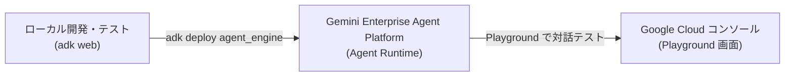

# 🚀 Cloud Shell でのローカル実行

## 1. リポジトリの準備
Cloud Shell ターミナルで、本リポジトリをクローンします。

```bash
git clone https://github.com/G-gen-Tech-Blog/adk-hackason.git
```


次に、本リポジトリに移動します。

```bash
cd ./adk-hackason
```

## 2. Python 仮想環境の作成と有効化
依存ライブラリの競合を防ぐため、Python の仮想環境（venv）を作成してアクティベートします。

```bash
# 仮想環境 (.venv) の作成
python3 -m venv .venv

# 仮想環境のアクティベート
source .venv/bin/activate
```

> **💡 仮想環境の終了方法**:
> 作業を終了して仮想環境を抜けたい場合は `deactivate` コマンドを実行します。

## 3. 依存パッケージのインストール
仮想環境内に必要なライブラリをインストールします。

```bash
pip install --upgrade pip
pip install -r requirements.txt
```

## 4. 環境変数の設定 (`.env`)
`.env.example` をコピーして `.env` を作成し、Google Cloud Project 情報を設定します。

```bash
cp .env.example .env
```

`.env` をエディタ（Cloud Shell または vim 等）で開き、講師が示すハンズオン用 Google Cloud プロジェクト ID を設定してください。なお Cloud Shell では `.` から始まる**隠しファイルはデフォルトでは表示されません**。上部メニューの View > Toggle Hidden Files を選択して、隠しファイルを表示してください。

```env
# Gemini Enterprise Agent Platform（旧称 Vertex AI） バックエンドを有効化 (1 または true)
GOOGLE_GENAI_USE_VERTEXAI=1

# Google Cloud プロジェクト ID
GOOGLE_CLOUD_PROJECT="my-project"

# Gemini Enterprise Agent Platform ロケーション / リージョン
# 例: global (推奨), us-central1, asia-northeast1 (東京) など
GOOGLE_CLOUD_LOCATION="global"

# 使用する Gemini モデル（デフォルト: gemini-3.7-flash）
GEMINI_MODEL="gemini-3.7-flash"
```

> **💡 Cloud Shell での認証について**:
> Cloud Shell 環境では自動的に Google Cloud 認証が適用されます。事前にプロジェクトで Gemini Enterprise Agent Platform（旧称 Vertex AI） API が有効になっていることを確認してください。
> ```bash
> gcloud services enable aiplatform.googleapis.com
> ```
> G-gen が指定する検証環境プロジェクトでは、既に有効になっています。

## 5. 開発用Webサーバーの起動 (`adk web`)
以下のコマンドで ADK Web UI を起動します。Cloud Shell の Web プレビュー機能からアクセスできるように `--allow_origins` を付与して起動します。

```bash
adk web --port 8080 --allow_origins="regex:.*"
```

`Enable telemetry?` と同意するプロンプトに対しては Y を入力して Enter を押下してください。

起動後、Cloud Shell の画面右上にある「**ウェブでプレビュー**」アイコン（ブラウザマーク）をクリックし、「**ポート 8080 でプレビュー**」を選択すると、ブラウザ上でエージェントの対話・動作確認画面（Chat UI）が開きます。

以下を参考にして、チャットを開始してください。

## 🧪 動作確認（テストシナリオ）

Web UI のチャット画面に、以下のテスト問い合わせ文を入力して実行してみてください。

### テスト例 1: 詳細調査ルート（技術問い合わせ・Enterprise顧客）
```text
お世話になっております。株式会社サンプル商事のシステム開発部 田中でございます。
本日14時頃より、弊社の本番バッチ処理において貴社APIから「429 Too Many Requests」のエラーが多発しており、顧客向けサービスへのデータ反映が遅延しております。
現在Standardから移行したEnterprise環境を利用しておりますが、早急にレート制限の上限緩和を行っていただくことは可能でしょうか。
本番影響が出ているため、至急の対応と手順のご教示をお願いいたします。
```
**期待される動作:**
1. **トリアージ & ルート判定**: カテゴリ「技術的課題」、緊急度「高」と判定され、`deep_check` ルートへ分岐。
2. **Fan-Out（並列実行）**:
   - ナレッジ検索でレート制限仕様（KB-001）と緩和手順を取得。
   - 顧客照会で Enterprise プラン、専任TAM（佐藤）、SLA 1時間以内を確認。
   - リスク分析で本番影響に伴う焦りやリスクを検知。
3. **Fan-In (JoinNode) & ドラフト作成**: 3つの結果が集約され、TAM連携と上限緩和申請手順を盛り込んだ返信ドラフトが生成。
4. **品質チェック**: 確定版の回答サマリが出力される。

### テスト例 2: クイック返信ルート（一般的な挨拶・簡易質問）
```text
いつも大変お世話になっております。貴社のサービスを導入検討している者です。
製品に関する資料や最新の導入事例集を拝見したいのですが、Webサイト上のどこからダウンロードできますでしょうか？
よろしくお願いいたします。
```
**期待される動作:**
1. **トリアージ & ルート判定**: カテゴリ「その他」、緊急度「低」と判定され、`quick_reply` ルートへ分岐（並列調査をスキップ）。
2. **クイック返信作成 & 品質チェック**: 迅速かつ丁寧な案内ドラフトが生成され、品質チェックを経て出力される。


# ☁️ Agent Runtime へのデプロイ

ローカル（`adk web`）での動作確認が完了したら、Google Cloud のフルマネージド環境 **Gemini Enterprise Agent Platform** の **Agent Runtime** にデプロイして公開します。

ADK 2.0 には専用のデプロイコマンド `adk deploy agent_engine` が標準搭載されており、コードの検証・コンテナ化・マネージド環境への登録までを自動で行うことができます。



---

## Step 1: 名称重複防止の処理

> [!IMPORTANT]
> **エージェント名の重複防止について**  
> 本ハンズオンでは全員が**同じ単一の Google Cloud プロジェクト**にデプロイするため、エージェント名（フォルダ名およびリソース名）が他の受講者と重複しないようにする必要があります。

まず、Cloud Shell ターミナル上で `adk web` コマンドで起動したテスト用サーバーがまだ動作している場合は、Ctrl + C で中断してください。

仮想環境（`.venv`）がアクティベートされている状態で、以下のコマンドを実行して受講者専用のエージェントフォルダを作成します。

```bash
# 1. エージェント名を変数にセット。XX は自身の検証用アカウント名の末尾の数字にしてください（例: 01）。
AGENT_NAME="customer_support_XX"

# customer_support フォルダを自分専用の名称に修正
mv customer_support "${AGENT_NAME}"
```

---

## Step 2: デプロイコマンドの実行 (`adk deploy agent_engine`)

プロジェクト ID を設定し、作成した自分専用のエージェントをデプロイします。
デプロイ先リージョンには **`us-central1`** を指定します。

> [!NOTE]
> **ホスティング環境（Agent Runtime）とモデルエンドポイントの違い**
> - **Agent Runtime（マネージド実行基盤）**: `us-central1` などの物理リージョンにデプロイされます（Agent Runtime は `global` リージョンに対応していません）。
> - **Gemini モデル（Gemini 3.7 Flash 等）**: 推論エンドポイントとして `global` を使用します（コード側で `global` エンドポイントが自動指定されるように構成されています）。

```bash
# プロジェクト ID を設定（検証環境のプロジェクト ID に書き換える）
PROJECT_ID="my-project"

# デプロイの実行（末尾に対象エージェントフォルダ ${AGENT_NAME} を指定）
adk deploy agent_engine \
  --project="${PROJECT_ID}" \
  --region="us-central1" \
  --display_name="${AGENT_NAME}" \
  "${AGENT_NAME}"
```

エージェント名を変えたい時は、シェル変数 AGENT_NAME を変更し、ソースコードを格納しているディレクトリ名も変更することで変更できます。

> [!TIP]
> **デプロイ処理の流れ**
> 1. エージェント定義（`${AGENT_NAME}` パッケージ）と依存関係の静的解析・検証
> 2. デプロイ用ソースコードの生成とステージング
> 3. Agent Runtime への登録と初期化（通常 2〜4 分程度）

デプロイが成功すると、ターミナルに以下のようなリソース識別子が出力されます。

```text
Deployed to Agent Platform: projects/<YOUR_PROJECT_ID>/locations/us-central1/reasoningEngines/<AGENT_ENGINE_ID>
```

出力された `<AGENT_ENGINE_ID>`（数字のID）をメモしておきます。Cloud Shell ではマウスで文字列を選択するだけで文字列がクリップボードにコピーされます。

さらに、以下のようなメッセージが出力されます。

```
🎉 View your deployed agent here:
https://console.cloud.google.com/vertex-ai/agents/agent-engines/locations/us-central1/agent-engines/<AGENT_ENGINE_ID>/playground?project=<PROJECT_NUMBER>>
```

この URL をクリックして、**プレイグラウンド**（Google Cloud コンソール上の動作確認 UI）に遷移することができます。

---

## Step 3: Google Cloud コンソールでの動作確認

デプロイ完了後、Google Cloud コンソール上の **Playground（プレイグラウンド）** から直接チャット形式で動作確認を行います。

先程の URL をクリックするか、あるいは以下の方法でプレイグラウンド画面へ移動できます。

1. **Google Cloud コンソールを開く**
   - [Google Cloud コンソール (Agent Runtime)](https://console.cloud.google.com/agent-platform/runtimes) にアクセスします。

2. **デプロイしたエージェントを選択**
   - 一覧画面から、Step 2 でデプロイしたご自身のエージェント（`customer_support_XX`）をクリックして詳細画面を開きます。
   - ※ 画面上部のリージョン選択が「**us-central1**（または「すべてのリージョン」）」になっていることを確認してください。

3. **プレイグラウンド画面へ遷移**
   - 画面上部の「**プレイグラウンド**」タブを選択します。

プレイグラウンド画面へ遷移できたら、以下のように動作確認してみましょう。

- チャット入力欄に、以下のテスト問い合わせ文を入力して送信します:
   ```text
   株式会社サンプル商事の田中です。本日14時頃より本番環境で貴社APIから429 Too Many Requestsエラーが多発しており業務に影響が出ています。至急の上限緩和と対応手順のご教示をお願いします。
   ```
- ワークフローが実行され、トリアージ ➔ 並列調査（ナレッジ/契約/リスク） ➔ 回答ドラフト作成 ➔ 品質チェック を経て、確定版の返信がチャット画面に出力されることを確認します。

## Step 4: 既存エージェントの更新（再デプロイ）

プロンプトの調整やツールの追加など、エージェントコード（`${AGENT_NAME}` 配下）を修正した後に既存の Agent Engine インスタンスを更新する場合は、`--agent_engine_id` オプションを指定して再実行します。

```bash
adk deploy agent_engine \
  --project="${PROJECT_ID}" \
  --region="us-central1" \
  --agent_engine_id="<YOUR_AGENT_ENGINE_ID>" \
  "${AGENT_NAME}"
```

---

## ⚠️ トラブルシューティング（デプロイ時）

| エラー・現象 | 主な原因と対策 |
| :--- | :--- |
| **`Usage: adk deploy agent_engine [OPTIONS] AGENT` / `Directory does not exist`** | コマンド末尾のエージェント引数に指定したフォルダ（`${AGENT_NAME}`）がローカルに実在するか確認してください（Step 1 の `mv` が実行されているか確認）。 |
| **`Deploy failed: Unexpected response from metadata server: service account info is missing 'email' field.`** | Cloud Shell 上での Google アカウント認証がうまくいっていない可能性があります。`gcloud auth application-default login` コマンドを実行して、再認証してください。 |
| **デプロイ実行時に処理が固まって進まない (Hang)** | `--region="global"` を指定していないか確認してください。Agent Runtime は `global` リージョンに対応していないため、`--region="us-central1"` を指定してください。 |
| **`403 Permission Denied`** | ユーザーまたはサービスアカウントに Agent Platform の権限（`roles/aiplatform.user` または `roles/aiplatform.admin`）が付与されているか、API (`aiplatform.googleapis.com`) が有効化されているか確認してください。 |

# 🎯 ハッカソン向け：エージェント適用業務のアイデア集

ADK 2.0 のマルチエージェントや `Workflow`（条件分岐、並列調査、集約、品質チェック）を活かせる業務ユースケースのアイデア例です。テーマ選定や企画の参考にしてください。

## 💼 営業・プリセールス
- **提案書・見積作成自動化**: 顧客の要望ヒアリング内容から要件抽出 ➔ 過去事例・技術仕様・価格表を並列検索 ➔ 提案書ドラフト生成 ➔ 利益率・規約チェック
- **商談事前リサーチ & 戦略立案**: 訪問先企業のIR・ニュース・業界動向を自動調査 ➔ 顧客の潜在課題とニーズを予測 ➔ 想定問答・トークスクリプト作成
- **失注・商談履歴分析**: SFA/CRMの商談ログを解析 ➔ 失注要因や競合動向をカテゴリ別に集約 ➔ 次回アプローチ施策を自動提案

## ⚖️ 法務・コンプライアンス・知財
- **契約書レビュー & リスク判定**: 契約条項の抽出 ➔ 自社法務基準・過去類似契約・関連法例を並列照会 ➔ リスク条項の指摘・修正案ドラフト作成
- **新規事業・新機能の法規制・ガイドライン審査**: サービス企画書の読み込み ➔ 個人情報保護法、景表法、業界ガイドラインとの適合性チェック ➔ 改善提言書作成
- **特許・商標侵害クリアランス**: アイデア・ネーミングの概要入力 ➔ 既存特許・商標DBの類似検索 ➔ 侵害リスク度判定と回避案提示

## 📣 マーケティング・広報・SNS
- **マルチチャネル向けコンテンツ同時展開**: プレスリリースや新着記事の要約 ➔ X, LinkedIn, note, メルマガ向けに最適なトーン＆マナーで並列生成 ➔ 炎上・ブランド毀損リスク判定
- **競合製品・市場トレンド調査レポート**: 各社Web・リリース情報の収集 ➔ 価格・機能・ターゲット層を多角的に比較分析 ➔ ポジショニングマップ・レポート生成
- **広告コピー・バナーテキスト大量生成**: ターゲット層別のペルソナ設定 ➔ 訴求軸（価格・スピード・品質等）ごとに複数案を並列生成 ➔ CTR予測・レギュレーション審査

## 🛠️ IT運用・情シス・セキュリティ
- **障害インシデント初動対応**: アラートログの解析 ➔ 過去障害ナレッジ・システム構成図・メトリクスを並列確認 ➔ 初動周知文の作成 & 復旧手順ドラフト
- **社内ITヘルプデスク & 権限申請自動化**: 従業員の質問・申請内容を判定 ➔ 社内規定チェック & 承認ルート特定 ➔ 申請チケット自動起票 & ユーザーへの初期案内
- **セキュリティ脆弱性（CVE）影響調査**: 新たに公開された脆弱性情報の取得 ➔ 社内システム・依存ライブラリ一覧との突合 ➔ 影響度評価 & パッチ適用優先度レポート作成

## 💻 ソフトウェア開発・エンジニアリング
- **Pull Request 自動レビュー & テスト生成**: コード差分の解析 ➔ セキュリティ・パフォーマンス・命名規則の並列検証 ➔ レビューコメント & ユニットテストコード作成
- **API仕様書・SDKドキュメント自動生成**: コード・スキーマ定義の読み込み ➔ 各エンドポイントの解説 & 多言語（Python/Go/TS等）サンプルコード作成 ➔ チュートリアル生成
- **レガシーコード解析・リファクタリング支援**: 古いコードの依存関係・処理フロー可視化 ➔ 最新言語仕様・フレームワークへの移行方針作成 ➔ 移行コードドラフト生成

## 👥 人事・採用・総務
- **中途採用レジュメスクリーニング & 面接質問生成**: 候補者レジュメのスキル抽出 ➔ 募集要項との適合度分析 ➔ 候補者に応じた深掘り面接設問リストの自動作成
- **社内規程・福利厚生・就業規則ナビゲーション**: 従業員の相談トリアージ ➔ 就業規則・育児介護規定・慶弔規定の横断検索 ➔ 申請手順の案内 & 必要書類ドラフト作成
- **新入社員オンボーディング支援**: 入社者の職種・部署に応じた研修カリキュラム提案 ➔ 必要な権限・PC初期設定手順のパーソナライズ案内 ➔ 定期フォローアップ面談の設問作成

## 💰 経理・財務・購買
- **経費精算・請求書突合 & 異常検知**: 請求書・領収書データ読み取り ➔ 購買申請・発注データ・社内規程と照合 ➔ 異常値・不正リスク検知 & 承認者向けサマリ作成
- **相見積もり比較 & 価格交渉支援**: 複数ベンダーの見積書を項目別に並列比較 ➔ 単価差分・仕様差分の可視化 ➔ コスト削減提案 & 価格交渉メール文作成
- **月次決算・業績差異分析レポート**: 財務諸表データの読み込み ➔ 予算実績差異・前年同期比の要因分析 ➔ 経営陣向け業績サマリ & コメントドラフト生成

## 🏭 業界特化型（製造・不動産・医療など）
- **製造現場の不具合・ヒヤリハット分析**: 現場日報やトラブル報告の解析 ➔ 過去トラブル事例・設備仕様書の照会 ➔ 原因仮説立案 & 再発防止策ドラフト作成
- **不動産物件提案 & エリアリサーチ**: 顧客の希望条件整理 ➔ 物件DB検索 & 周辺環境（学区・治安・ハザードマップ・利便性）の並列リサーチ ➔ 提案レター作成
- **医療・介護の申し送り・カルテ要約**: 日々のバイタル・看護記録の読み取り ➔ 申し送り事項・注意フラグの抽出 ➔ 次シフト向け引き継ぎサマリ作成

# 💡 ハッカソンでのカスタマイズ・拡張ガイド

## 1. ワークフローグラフの変更・追加 (`agent.py`)
- **新しい専門エージェントの追加**: 例えば、Step 2 に「**競合比較エージェント**」や「**法務チェックエージェント**」を追加したい場合は、`LlmAgent` を定義し、`parallel_trigger` からのエッジと `gather_research` へのエッジを追加するだけで簡単に並列エージェントを増やせます。
- **新しい条件分岐の作成**: `route_decision_node` のように `FunctionNode` で `ctx.route` をセットし、`edges` に辞書 `{ "route_name": destination_node }` を指定します。

## 2. プロンプトのカスタマイズ (`prompts/`)
- `prompts/` 配下の各ファイルを編集することで、指示内容、判定基準、出力フォーマットを即座に変更できます。
- `{triage_result?}`, `{knowledge_result?}` などのプレースホルダーにより、前段ノードの実行結果をセッションステートから参照可能です。

## 3. ツールの追加・差し替え (`tools/`)
- `tools/` 配下の Python 関数を自由に変更・追加できます。
- 関数の docstring と型ヒントを記述して `LlmAgent(tools=[your_tool_func])` に渡すだけで、Gemini が自動的に Tool Calling を行います。
- 外部 REST API や BigQuery などの実データベースへの接続へも容易に差し替え可能です。

# クリーンアップ

1. Google Cloud コンソールで、Agent Runtime のエージェント一覧画面へ遷移します。
    - Agent Platform > デプロイ
2. エージェント一覧画面から、自分のデプロイしたエージェントの名前の右端の三点リーダーをクリックします。
3. プルダウンメニューから「削除」を選択します。
4. テキストボックスに、**漢字**で「削除」と入力し、削除ボタンを押下します。
    - 日本語コンソールのローカライズの誤りで、「『DELETE』と入力してください」と表記されていますが、漢字で入力する必要があります（将来的に修正される可能性あり）。
    - コンソールの言語設定が英語ならば、DELETE を入力します。