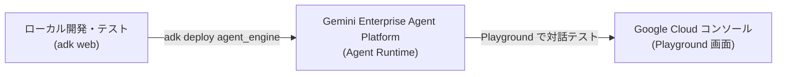

# 🚀 Cloud Shell でのローカル実行

## 1. リポジトリの準備
Cloud Shell ターミナルで、本リポジトリをクローンします。

```bash
git clone https://github.com/G-gen-Tech-Blog/adk-hackason.git
```


次に、本リポジトリに移動します。

```bash
cd ./adk-hackason
```

## 2. Python 仮想環境の作成と有効化
依存ライブラリの競合を防ぐため、Python の仮想環境（venv）を作成してアクティベートします。

```bash
# 仮想環境 (.venv) の作成
python3 -m venv .venv

# 仮想環境のアクティベート
source .venv/bin/activate
```

> **💡 仮想環境の終了方法**:
> 作業を終了して仮想環境を抜けたい場合は `deactivate` コマンドを実行します。

## 3. 依存パッケージのインストール
仮想環境内に必要なライブラリをインストールします。

```bash
pip install --upgrade pip
pip install -r requirements.txt
```

## 4. 環境変数の設定 (`.env`)
`.env.example` をコピーして `.env` を作成し、Google Cloud Project 情報を設定します。

```bash
cp .env.example .env
```

`.env` をエディタ（Cloud Shell または vim 等）で開き、講師が示すハンズオン用 Google Cloud プロジェクト ID を設定してください。なお Cloud Shell では `.` から始まる**隠しファイルはデフォルトでは表示されません**。上部メニューの View > Toggle Hidden Files を選択して、隠しファイルを表示してください。

```env
# Gemini Enterprise Agent Platform（旧称 Vertex AI） バックエンドを有効化 (1 または true)
GOOGLE_GENAI_USE_VERTEXAI=1

# Google Cloud プロジェクト ID
GOOGLE_CLOUD_PROJECT="my-project"

# Gemini Enterprise Agent Platform ロケーション / リージョン
# 例: global (推奨), us-central1, asia-northeast1 (東京) など
GOOGLE_CLOUD_LOCATION="global"

# 使用する Gemini モデル（デフォルト: gemini-3.8-flash）
GEMINI_MODEL="gemini-3.8-flash"
```

> **💡 Cloud Shell での認証について**:
> Cloud Shell 環境では自動的に Google Cloud 認証が適用されます。事前にプロジェクトで Gemini Enterprise Agent Platform（旧称 Vertex AI） API が有効になっていることを確認してください。
> ```bash
> gcloud services enable aiplatform.googleapis.com
> ```
> G-gen が指定する検証環境プロジェクトでは、既に有効になっています。

## 5. 開発用Webサーバーの起動 (`adk web`)
以下のコマンドで ADK Web UI を起動します。Cloud Shell の Web プレビュー機能からアクセスできるように `--allow_origins` を付与して起動します。

```bash
adk web --port 8080 --allow_origins="regex:.*"
```

`Enable telemetry?` と同意するプロンプトに対しては Y を入力して Enter を押下してください。

起動後、Cloud Shell の画面右上にある「**ウェブでプレビュー**」アイコン（ブラウザマーク）をクリックし、「**ポート 8080 でプレビュー**」を選択すると、ブラウザ上でエージェントの対話・動作確認画面（Chat UI）が開きます。

以下を参考にして、チャットを開始してください。

## 🧪 動作確認（テストシナリオ）

Web UI のチャット画面に、以下のテスト問い合わせ文を入力して実行してみてください。

### テスト例 1: 詳細調査ルート（技術問い合わせ・Enterprise顧客）
```text
お世話になっております。株式会社サンプル商事のシステム開発部 田中でございます。
本日14時頃より、弊社の本番バッチ処理において貴社APIから「429 Too Many Requests」のエラーが多発しており、顧客向けサービスへのデータ反映が遅延しております。
現在Standardから移行したEnterprise環境を利用しておりますが、早急にレート制限の上限緩和を行っていただくことは可能でしょうか。
本番影響が出ているため、至急の対応と手順のご教示をお願いいたします。
```
**期待される動作:**
1. **トリアージ & ルート判定**: カテゴリ「技術的課題」、緊急度「高」と判定され、`deep_check` ルートへ分岐。
2. **Fan-Out（並列実行）**:
   - ナレッジ検索でレート制限仕様（KB-001）と緩和手順を取得。
   - 顧客照会で Enterprise プラン、専任TAM（佐藤）、SLA 1時間以内を確認。
   - リスク分析で本番影響に伴う焦りやリスクを検知。
3. **Fan-In (JoinNode) & ドラフト作成**: 3つの結果が集約され、TAM連携と上限緩和申請手順を盛り込んだ返信ドラフトが生成。
4. **品質チェック**: 確定版の回答サマリが出力される。

### テスト例 2: クイック返信ルート（一般的な挨拶・簡易質問）
```text
いつも大変お世話になっております。貴社のサービスを導入検討している者です。
製品に関する資料や最新の導入事例集を拝見したいのですが、Webサイト上のどこからダウンロードできますでしょうか？
よろしくお願いいたします。
```
**期待される動作:**
1. **トリアージ & ルート判定**: カテゴリ「その他」、緊急度「低」と判定され、`quick_reply` ルートへ分岐（並列調査をスキップ）。
2. **クイック返信作成 & 品質チェック**: 迅速かつ丁寧な案内ドラフトが生成され、品質チェックを経て出力される。


# ☁️ Agent Runtime へのデプロイ

ローカル（`adk web`）での動作確認が完了したら、Google Cloud のフルマネージド環境 **Gemini Enterprise Agent Platform** の **Agent Runtime** にデプロイして公開します。

ADK 2.0 には専用のデプロイコマンド `adk deploy agent_engine` が標準搭載されており、コードの検証・コンテナ化・マネージド環境への登録までを自動で行うことができます。


```mermaid
flowchart LR
    Dev["ローカル開発・テスト<br/>(adk web)"] -->|adk deploy agent_engine| Platform["Gemini Enterprise Agent Platform<br/>(Agent Runtime)"]
    Platform -->|Playground で対話テスト| Console["Google Cloud コンソール<br/>(Playground 画面)"]
```

---

## Step 1: 名称重複防止の処理

> [!IMPORTANT]
> **エージェント名の重複防止について**  
> 本ハンズオンでは全員が**同じ単一の Google Cloud プロジェクト**にデプロイするため、エージェント名（フォルダ名およびリソース名）が他の受講者と重複しないようにする必要があります。

まず、Cloud Shell ターミナル上で `adk web` コマンドで起動したテスト用サーバーがまだ動作している場合は、Ctrl + C で中断してください。

仮想環境（`.venv`）がアクティベートされている状態で、以下のコマンドを実行します。

まずは、シェル変数に、環境独自の値をセットします。

```bash
# エージェント名を変数にセット。XX は自身の検証用アカウント名の末尾の数字にしてください（例: 01）。
AGENT_NAME="customer_support_XX"

# プロジェクト ID を設定（検証環境のプロジェクト ID に書き換える）
PROJECT_ID="my-project"
```

次に、シェル変数の中身を確認します。

```bash
# 正しく変数の内容が表示されていますか？書き換え忘れていませんか？
echo ${AGENT_NAME}
echo ${PROJECT_ID}
```

受講者専用のエージェントフォルダを作成します。この名称でクラウドリソースが作成されるため、名前が他の受講者と重複していると、デプロイできません。

```bash
# customer_support フォルダを自分専用の名称に修正
mv customer_support "${AGENT_NAME}"
```

---

## Step 2: デプロイコマンドの実行 (`adk deploy agent_engine`)

プロジェクト ID を設定し、作成した自分専用のエージェントをデプロイします。
デプロイ先リージョンには **`us-central1`** を指定します。

> [!NOTE]
> **ホスティング環境（Agent Runtime）とモデルエンドポイントの違い**
> - **Agent Runtime（マネージド実行基盤）**: `us-central1` などの物理リージョンにデプロイされます（Agent Runtime は `global` リージョンに対応していません）。
> - **Gemini モデル（Gemini 3.7 Flash 等）**: 推論エンドポイントとして `global` を使用します（コード側で `global` エンドポイントが自動指定されるように構成されています）。

```bash
# デプロイの実行（末尾に対象エージェントフォルダ ${AGENT_NAME} を指定）
adk deploy agent_engine \
  --project="${PROJECT_ID}" \
  --region="us-central1" \
  --display_name="${AGENT_NAME}" \
  "${AGENT_NAME}"
```

エージェント名を変えたい時は、シェル変数 AGENT_NAME を変更し、ソースコードを格納しているディレクトリ名も変更することで変更できます。

> [!TIP]
> **デプロイ処理の流れ**
> 1. エージェント定義（`${AGENT_NAME}` パッケージ）と依存関係の静的解析・検証
> 2. デプロイ用ソースコードの生成とステージング
> 3. Agent Runtime への登録と初期化（通常 2〜4 分程度）

デプロイが成功すると、ターミナルに以下のようなリソース識別子が出力されます。

```text
Deployed to Agent Platform: projects/<YOUR_PROJECT_ID>/locations/us-central1/reasoningEngines/<AGENT_ENGINE_ID>
```

出力された `<AGENT_ENGINE_ID>`（数字のID）をメモしておきます。Cloud Shell ではマウスで文字列を選択するだけで文字列がクリップボードにコピーされます。

さらに、以下のようなメッセージが出力されます。

```
🎉 View your deployed agent here:
https://console.cloud.google.com/vertex-ai/agents/agent-engines/locations/us-central1/agent-engines/<AGENT_ENGINE_ID>/playground?project=<PROJECT_NUMBER>>
```

この URL をクリックして、**プレイグラウンド**（Google Cloud コンソール上の動作確認 UI）に遷移することができます。

---

## Step 3: Google Cloud コンソールでの動作確認

デプロイ完了後、Google Cloud コンソール上の **Playground（プレイグラウンド）** から直接チャット形式で動作確認を行います。

先程の URL をクリックするか、あるいは以下の方法でプレイグラウンド画面へ移動できます。

1. **Google Cloud コンソールを開く**
   - [Google Cloud コンソール (Agent Runtime)](https://console.cloud.google.com/agent-platform/runtimes) にアクセスします。

2. **デプロイしたエージェントを選択**
   - 一覧画面から、Step 2 でデプロイしたご自身のエージェント（`customer_support_XX`）をクリックして詳細画面を開きます。
   - ※ 画面上部のリージョン選択が「**us-central1**（または「すべてのリージョン」）」になっていることを確認してください。

3. **プレイグラウンド画面へ遷移**
   - 画面上部の「**プレイグラウンド**」タブを選択します。

プレイグラウンド画面へ遷移できたら、以下のように動作確認してみましょう。

- チャット入力欄に、以下のテスト問い合わせ文を入力して送信します:
   ```text
   株式会社サンプル商事の田中です。本日14時頃より本番環境で貴社APIから429 Too Many Requestsエラーが多発しており業務に影響が出ています。至急の上限緩和と対応手順のご教示をお願いします。
   ```
- ワークフローが実行され、トリアージ ➔ 並列調査（ナレッジ/契約/リスク） ➔ 回答ドラフト作成 ➔ 品質チェック を経て、確定版の返信がチャット画面に出力されることを確認します。

## Step 4: 既存エージェントの更新（再デプロイ）

プロンプトの調整やツールの追加など、エージェントコード（`${AGENT_NAME}` 配下）を修正した後に既存の Agent Engine インスタンスを更新する場合は、`--agent_engine_id` オプションを指定して再実行します。

```bash
adk deploy agent_engine \
  --project="${PROJECT_ID}" \
  --region="us-central1" \
  --agent_engine_id="<YOUR_AGENT_ENGINE_ID>" \
  "${AGENT_NAME}"
```

---

## ⚠️ トラブルシューティング（デプロイ時）

| エラー・現象 | 主な原因と対策 |
| :--- | :--- |
| **`Usage: adk deploy agent_engine [OPTIONS] AGENT` / `Directory does not exist`** | コマンド末尾のエージェント引数に指定したフォルダ（`${AGENT_NAME}`）がローカルに実在するか確認してください（Step 1 の `mv` が実行されているか確認）。 |
| **`Deploy failed: Unexpected response from metadata server: service account info is missing 'email' field.`** | Cloud Shell 上での Google アカウント認証がうまくいっていない可能性があります。`gcloud auth application-default login` コマンドを実行して、再認証してください。 |
| **デプロイ実行時に処理が固まって進まない (Hang)** | `--region="global"` を指定していないか確認してください。Agent Runtime は `global` リージョンに対応していないため、`--region="us-central1"` を指定してください。 |
| **`403 Permission Denied`** | ユーザーまたはサービスアカウントに Agent Platform の権限（`roles/aiplatform.user` または `roles/aiplatform.admin`）が付与されているか、API (`aiplatform.googleapis.com`) が有効化されているか確認してください。 |
| **`errorCode: "RefreshError"`** | Cloud Shell 上の認証セッションが切れている可能性があります。三点リーダーからCloud Shell を再起動 → `gcloud auth application-default login` → `gcloud auth login` をすべて実行してください。 |
| **`errorCode: "_ResourceExhaustedError"`** | Google 側でリソースが枯渇しています。時間をおいて再実行してください。 |

# クリーンアップ

ハンズオン終了後は、以下の手順で作成したリソースのクリーンアップを行います。エージェント本体を削除する前に、Gemini Enterprise アプリからの紐づけを解除してください。

## 1. Gemini Enterprise アプリからエージェントの紐づけを削除

1. Google Cloud コンソールで、**Gemini Enterprise** の画面へ遷移します。
    - ナビゲーションメニュー > **Gemini Enterprise**
    - または `https://console.cloud.google.com/gemini-enterprise/apps` にアクセス
2. アプリ一覧から「**adk-hackason**」を選択します。
3. 左部メニューから「エージェント」を押下します。
3. エージェント一覧から、ご自身がデプロイしたエージェント（`${AGENT_NAME}`）を見つけます。
4. 対象のエージェント名の右端の三点リーダーをクリックし、プルダウンメニューから「**削除**」を選択します。
5. 「はい」と入力して確認ボタンを押下します。

## 2. Agent Runtime からのエージェント削除

1. Google Cloud コンソールで、Agent Runtime のエージェント一覧画面へ遷移します。
    - **Agent Platform** > **デプロイ**
    - または `https://console.cloud.google.com/agent-platform/runtimes` にアクセス
2. エージェント一覧画面から、自分のデプロイしたエージェントの名前の右端の三点リーダーをクリックし、プルダウンメニューから「削除」を選択します。
3. テキストボックスに、**漢字**で「削除」と入力し、削除ボタンを押下します。
    - 日本語コンソールのローカライズの誤りで、「『DELETE』と入力してください」と表記されていますが、漢字で入力する必要があります（将来的に修正される可能性あり）。
    - コンソールの言語設定が英語ならば、DELETE を入力します。