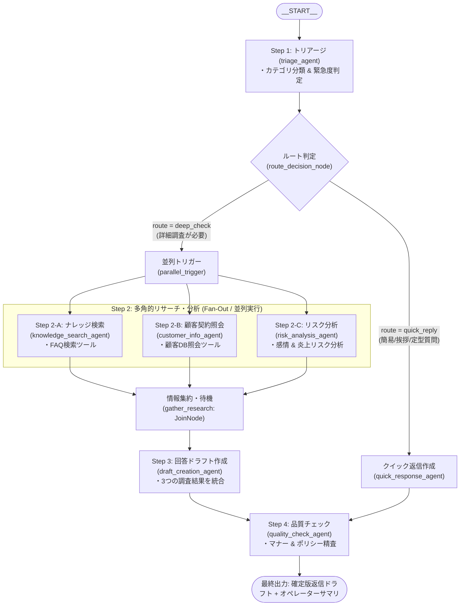

# ADK ハッカソン サンプルシステム設計書 (`system_design.md`)

## 1. 概要・目的

当システムは、株式会社G-genが実施する「ADK ハッカソン」において、参加者が Google の最新エージェント開発フレームワーク **Agent Development Kit (ADK) 2.0** を用いたマルチエージェントシステムの開発を体験・学習するためのリファレンス実装です。

### ハッカソンでのゴール
- **ADK 2.0 グラフベース・オーケストレーション (`Workflow`) の理解**:
  条件分岐（Routing）、並列実行（Fan-Out）、同期・集約（Fan-In / JoinNode）、品質チェック（Sequential）の設計と実装を体験する。
- **業務シナリオの適用と迅速なカスタマイズ**:
  プロンプト、ツール、エージェント構成をモジュール単位で差し替え、自社の業務課題に応じた AI エージェントを短時間で構築する。
- **Cloud Shell 上での実行・対話検証**:
  ブラウザ上の Web UI (`adk web`) を通じて、エージェントの思考プロセス、ステート遷移、Tool Calling の動作をリアルタイムに確認する。

---

## 2. システム要件 & 技術スタック

| 項目 | 採用技術・仕様 | 備考 |
| :--- | :--- | :--- |
| **開発言語** | Python 3.10+ (推奨: Python 3.12) | 型ヒントおよび非同期処理に対応 |
| **フレームワーク** | Google Agent Development Kit (ADK) 2.0 (v2.6+) | グラフベース `Workflow` オーケストレーション |
| **基盤モデル (LLM)** | Gemini 3.7 Flash (`gemini-3.7-flash`) | 推奨・標準モデル |
| **バックエンド連携** | Gemini Enterprise Agent Platform（旧称 Vertex AI） | `GOOGLE_GENAI_USE_VERTEXAI=1` による Google Cloud Project ネイティブ連携 |
| **開発・実行環境** | Google Cloud Shell / Linux (ローカル環境) | 仮想環境 (`.venv`) および `adk web` 開発用UI |
| **セッション管理** | ADK Local Session Service (SQLite / SQLite DB) | 会話履歴および各ノードのステートを保持 |

---

## 3. 業務シナリオ仕様

ビジネスシーンで汎用性が高く、直感的に効果を実感しやすい「**カスタマーサポートにおける問い合わせ自動トリアージ＆回答ドラフト作成ワークフロー**」を採用しています。

### 業務フローの流れ
1. **問い合わせ受付とトリアージ（Step 1: Sequential）**:
   顧客からの問い合わせ文を受け取り、問い合わせの「カテゴリ分類（技術的課題、契約/請求、不具合報告、一般的な質問等）」および「緊急度（高/中/低）」を判定。
2. **ルート判定（Routing）**:
   - 簡易な定型質問・一般的な挨拶（カテゴリ: その他 かつ 緊急度: 低）の場合 ➡️ **クイック返信ルート** へ分岐。
   - 詳細な調査が必要な場合（技術的課題、不具合、契約照会など） ➡️ **詳細調査ルート（Fan-Out）** へ分岐。
3. **多角的リサーチと分析（Step 2: Fan-Out / 並列実行）**:
   3つの専門エージェントが独立して並列調査を実行。
   - **ナレッジ検索 (`knowledge_search_agent`)**: 社内FAQ/マニュアルから解決策を検索（Tool Calling）。
   - **顧客情報照会 (`customer_info_agent`)**: 顧客プラン、SLA、専任TAMの有無を確認（Tool Calling）。
   - **感情・リスク分析 (`risk_analysis_agent`)**: 顧客の感情トーン、炎上・解約リスクをスコアリング。
4. **情報集約と同期（Fan-In / `JoinNode`）**:
   3つの調査がすべて完了したタイミングで同期し、結果を後続ノードへ集約。
5. **回答ドラフト作成（Step 3: Draft Creation）**:
   3つの調査結果（ナレッジ・顧客属性・リスク度）を統合し、オペレーター向け対応サマリと顧客向け返信メール案を生成。
6. **品質・ポリシーチェック（Step 4: Quality Check）**:
   クイック返信または詳細ドラフトに対し、ビジネスマナー、トーン＆マナー、NG表現をチェックし、最終確定版パッケージを出力。

---

## 4. ワークフロー・アーキテクチャ設計

### 4.1 ワークフローグラフ (Mermaid)



### 4.2 コンポーネント一覧と役割

| ノード / エージェント名 | 種別 | 役割・処理内容 | 入出力 / ツール |
| :--- | :--- | :--- | :--- |
| **`START`** | システム定数 | ワークフローの開始エントリポイント | ユーザーの問い合わせ文 |
| **`triage_agent`** | `LlmAgent` | カテゴリ分類・緊急度判定（構造化出力） | 出力スキーマ: `TriageResult` (Pydantic)<br/>出力: `triage_result` |
| **`route_decision_node`** | `FunctionNode` | トリアージ結果から分岐先を決定 (`ctx.route`) | `deep_check` または `quick_reply` |
| **`parallel_trigger`** | `FunctionNode` | 並列処理（Fan-Out）への入力を中継 | 後続の3エージェントへ分配 |
| **`knowledge_search_agent`** | `LlmAgent` | 社内FAQ・ナレッジベースの検索 | ツール: `search_knowledge_base`<br/>出力: `knowledge_result` |
| **`customer_info_agent`** | `LlmAgent` | 顧客契約プラン・SLA・TAM情報の照会 | ツール: `get_customer_info`<br/>出力: `customer_result` |
| **`risk_analysis_agent`** | `LlmAgent` | 顧客トーン分析・感情＆炎上リスク判定 | 出力: `risk_result` |
| **`gather_research`** | `JoinNode` | 並列3ブランチの完了を待機・同期 | 3つの調査結果が揃うまで待機 |
| **`quick_response_agent`** | `LlmAgent` | 簡易質問に対する迅速な一次返信案作成 | 出力: `draft_result` |
| **`draft_creation_agent`** | `LlmAgent` | 3つの調査結果を集約し返信ドラフト作成 | 出力: `draft_result` |
| **`quality_check_agent`** | `LlmAgent` | ガイドラインチェック・確定版パッケージ作成 | 出力: `final_result` (最終回答) |

### 4.3 セッションステートとデータ連携設計

ADK のセッションステート（`ctx.state`）を活用し、各エージェントの `output_key` を後続エージェントのプロンプト内にプレースホルダー `{output_key?}` として埋め込みます。
また、`triage_agent` には Pydantic モデル `TriageResult` による **Structured Outputs（構造化出力）** を適用しており、後続の `route_decision_node` で型安全な属性・キーアクセスによる正確な条件分岐を実現しています。

```python
# 例: draft_creation_agent のプロンプト内
DRAFT_INSTRUCTION = """
以下のトリアージ結果および調査内容を踏まえて回答を作成してください。

【トリアージ結果】
{triage_result?}

【ナレッジ検索結果】
{knowledge_result?}

【顧客・契約情報】
{customer_result?}

【感情・リスク分析】
{risk_result?}
"""
```

---

## 5. プロジェクト・ディレクトリ構成 (ADK ベストプラクティス)

リポジトリ名にハイフン（`-`）が含まれる場合でも、Python の動的インポート制限（英数字・`_` のみ）に抵触しないよう、**有効な Python 識別子名のサブパッケージ（`customer_support/`）** をリポジトリ直下に配置する構成を採用しています。

```
adk-hackason/                             # リポジトリルート（ハイフン付きでOK）
├── customer_support/                     # エージェントパッケージ（Python識別子命名）
│   ├── __init__.py                       # root_agent をエクスポート
│   ├── agent.py                          # ADK 2.0 Workflow / エージェント定義 (root_agent)
│   ├── prompts/                          # 各エージェントのプロンプトモジュール
│   │   ├── __init__.py
│   │   ├── triage.py                     # Step 1: トリアージ用プロンプト
│   │   ├── quick.py                      # 分岐: クイック返信用プロンプト
│   │   ├── knowledge.py                  # Step 2-A: ナレッジ検索用プロンプト
│   │   ├── customer.py                   # Step 2-B: 顧客照会用プロンプト
│   │   ├── risk.py                       # Step 2-C: 感情・リスク分析用プロンプト
│   │   ├── draft.py                      # Step 3: 回答ドラフト作成用プロンプト
│   │   └── quality.py                    # Step 4: 品質チェック用プロンプト
│   └── tools/                            # モックツール・関数定義
│       ├── __init__.py
│       ├── knowledge_tool.py             # FAQ/ナレッジ検索 (search_knowledge_base)
│       └── customer_tool.py              # 顧客情報照会 (get_customer_info)
├── .agents/                              # Antigravity カスタマイズ・知見格納用
│   └── skills/
│       └── adk-development/              # ADK 開発ベストプラクティス Skill
│           ├── SKILL.md
│           └── references/
├── scenarios/                            # テスト検証用シナリオ集
│   └── test_scenarios.md                 # 動作確認用プロンプト集
├── requirements/                         # 要件定義
│   └── requirements.md
├── system_design.md                      # 本設計書
├── requirements.txt                      # 依存ライブラリ一覧
├── .env / .env.example                   # 環境変数設定
├── .gitignore
└── README.md                             # プロジェクト説明・実行手順
```

---

## 6. ツール仕様 (Mock Tools)

ハッカソン参加者が外部DBやAPIの準備なしですぐに動作確認できるよう、実用的なモックツールを提供しています。

### 6.1 ナレッジ検索ツール (`search_knowledge_base`)
- **関数シグネチャ**: `search_knowledge_base(query: str) -> str`
- **データ源**: モックナレッジベース（辞書形式）
  - `KB-001`: API レート制限（429エラー）の仕様と上限緩和申請手順
  - `KB-002`: パスワードリセット・アカウントロック解除手順
  - `KB-003`: CSV データエクスポート文字化け対応手順
  - `KB-004`: 二要素認証 (2FA) 設定手順

### 6.2 顧客情報照会ツール (`get_customer_info`)
- **関数シグネチャ**: `get_customer_info(customer_name_or_domain: str) -> str`
- **データ源**: モック顧客データベース
  - サンプル商事（Enterprise プラン, SLA: 1時間以内, 担当TAM: 佐藤）
  - テスト株式会社（Standard プラン, SLA: 4時間以内, 担当TAM: なし）
  - グローバル物産（Enterprise プラン, SLA: 1時間以内, 担当TAM: 鈴木）

---

## 7. 実行・運用・開発ガイド

### 7.1 Web UI 起動コマンド
Cloud Shell の「ウェブでプレビュー」環境からのアクセスを許可するため、`--allow_origins="regex:.*"` を付与して起動します。

```bash
adk web --port 8080 --allow_origins="regex:.*"
```

### 7.2 エージェント読み込み診断
起動前にエージェントが正常にローダーで認識されるかを確認するコマンド:

```bash
python3 -c "
from google.adk.cli.utils.agent_loader import AgentLoader
loader = AgentLoader('.')
for app in loader.list_agents_detailed():
    print('Loaded:', app['name'], '->', app['root_agent_name'])
"
```

### 7.3 ハッカソン参加者向けカスタマイズ指針
1. **プロンプトの調整**: `customer_support/prompts/` の各ファイルを変更するだけで、回答トーンや分類基準を即座に変更可能。
2. **ツールの追加・差し替え**: `customer_support/tools/` に新しい関数を定義し、該当エージェントの `tools=[...]` に渡すだけで Tool Calling が有効化。
3. **並列エージェントの追加**: `customer_support/agent.py` で新しい `LlmAgent` を定義し、`parallel_trigger` と `gather_research` の間にエッジを追加するだけで Fan-Out を拡張可能。
